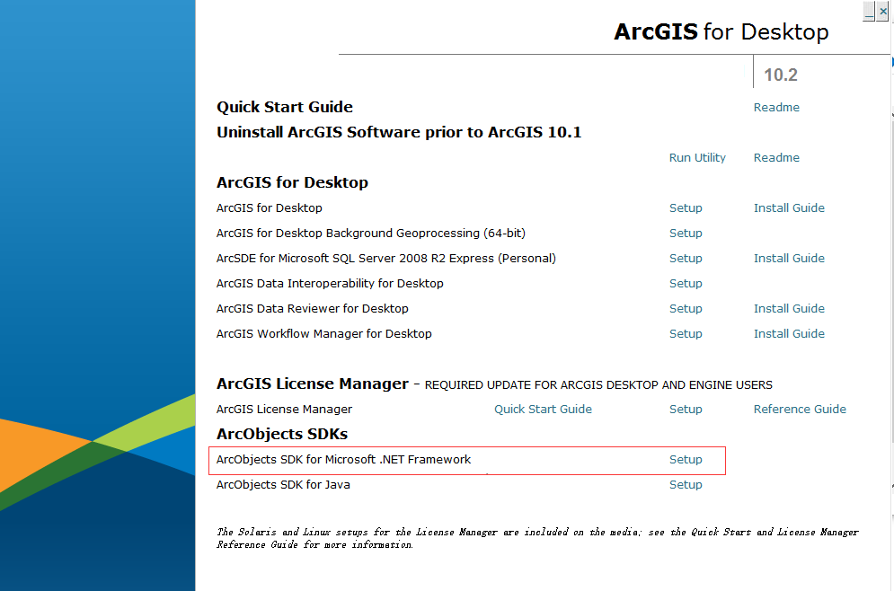
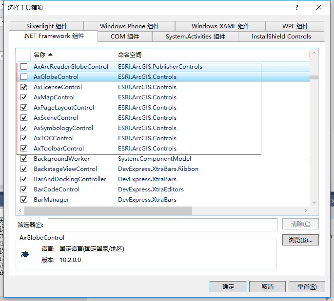
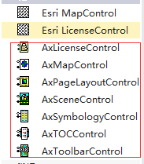
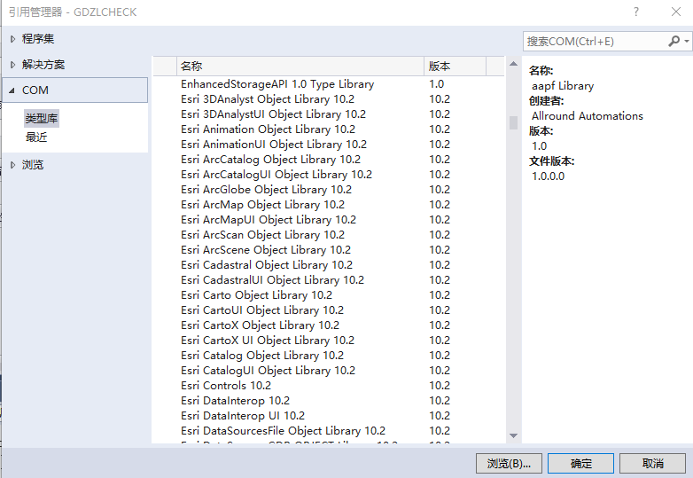
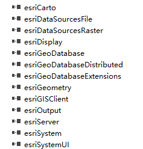
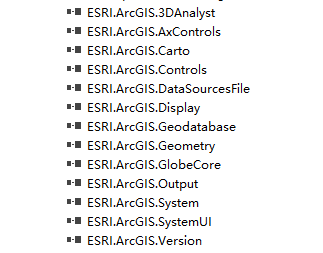
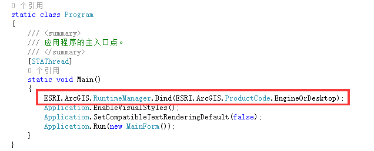
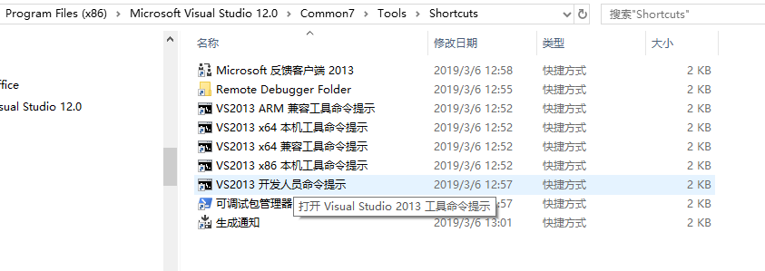
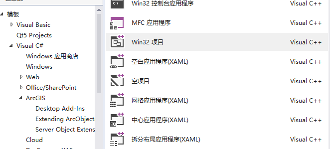

ArcObjects SDK for Microsoft .Net Framework 10.1或10.2在安装时，会检测VS2010或VS2012的安装路径，而有时因为其他项目使用限制而且不愿同时安装多个版本的VS,通过修改注册表方式实现安装
<!--more-->
# 背景
ArcObjects SDK for Microsoft .Net Framework 10.1或10.2在安装时，会检测VS2010或VS2012的安装路径，而有时因为其他项目使用限制而且不愿同时安装多个版本的VS,通过修改注册表方式实现安装
# 具体步骤
## 1.修改注册表
首先打开注册表，window系统可以通过win+R，输入regedit后，回车打开注册表

找到__计算机\HKEY_LOCAL_MACHINE\SOFTWARE\WOW6432Node\Microsoft\VisualStudio\10.0__，点击10.0文件夹，此时是没有InstallDir和ShellFolder两个字符串值

找到__计算机\HKEY_LOCAL_MACHINE\SOFTWARE\WOW6432Node\Microsoft\VisualStudio\12.0__,点击12.0文件夹，查看InstallDir值，并复制

回到10.0目录，右键新建-\>字符串值，新建InstallDir值，双击编辑值，将刚复制的粘贴

同样的处理，添加ShellFolder
## 2.安装ArcObjects SDK for Microsoft .Net Framework
打开ArcGIS Desktop 或ArcEngine安装程序，找到ArcObjects SDK for Microsoft .Net Framework，点击安装，此时就不会提示要求VS2010或VS2012安装环境了，下面以ArcGIS Desktop 为例：

## 3. 在工具箱中添加ArcGIS相关组件
由于通过修改注册表的方式安装的ArcObjects SDK for Microsoft .Net Framework，因此，可能会导致VS中没有ArcGIS相关工具，需要手动添加

打开VS2013,任意打开一个窗体，打开工具箱，会发现没有ArcGIS选项卡，因此，首先右键__新建选项卡__，然后右键，点击__选择项__,在.NET Framework组件下，找到下图所示的ArcGIS组件

### 方案1
注意，如果在.NET Framework下找不到相关组件，可以点击__浏览__,找到ArcObjects SDK for Microsoft .Net Framework的安装目录下的DotNet，一般路径为`D:\Program Files (x86)\ArcGIS\DeveloperKit10.2\DotNet`如下图所示，可以按需添加，或者按住__Shift__全选添加。

勾选需要的组件，点击确定后，在新建的选项卡下出现组件
    
 
     
    

红色框为新添加的.NET组件，上面两个是COM组件，暂时不需要使用，下节介绍.NET组件和COM组件的区别  

### 方案2
在Desktop安装目录的bin下找到需要的控件，以.ocx为后缀，选中后拖入工具箱

## 添加引用
在不做任何手动操作时，安装了ArcGIS Desktop之后，可以在COM下的类型库中找到ArcGIS 相关的COM组件，如下图所示

注意点击引用这些组件时，引用呈现下图所示结果：

 

但会发现找不到Esri.ArcGIS.Version的库，而这个库必须在主函数入口处使用获得授权许可，之后才能使用ArcEngine中相关的类或接口。

因此，__这里在添加引用是选择.NET组件__，点击__浏览__找到ArcObjects SDK for Microsoft .Net Framework的安装目录下的DotNet，一般路径为`D:\Program Files (x86)\ArcGIS\DeveloperKit10.2\DotNet`如下图所示，选择Esri.ArcGIS.Version.dll，其他库VS会根据需要自动引用。如上图图3所示.
注意点击引用这些组件时，引用呈现下图所示结果：

 

# Program.cs中授权
在Main函数中添加 `ESRI.ArcGIS.RuntimeManager.Bind(ESRI.ArcGIS.ProductCode.EngineOrDesktop);`,如下图所示

直至就可以在一个应用程序中使用ArcEngine的功能了。

当然如果你想使用VS创建ArcGIS模板应用程序，此时你会发现Visual C#下没有ArcGIS选项，这时又需要我们手动添加了

# 手动添加ArcGIS项目模板
由于我们最开始安装SDK时，采用了修改注册表的方式骗过ArcObject检测，因此，模板默认安装在了但是设置的VS2013安装路径Microsoft Visio Studio 12.0下了
1. 将模板拷贝至vs模板库中
找到D:\Program Files (x86)\Microsoft Visual Studio 12.0\Microsoft Visual Studio 10.0，在Common7/IDE下有两个文件夹__ItemTemplates/CSharp/ArcGIS__,__ProjectTemplates/CSharp/ArcGIS__,
分别拷贝在vs2013模板文件位置，如：
D:\Program Files (x86)\Microsoft Visual Studio 12.0\Common7\IDE\\__ItemTemplates__\CSharp和  
I:\Program Files (x86)\Microsoft Visual Studio 12.0\Common7\IDE\\__ProjectTemplates__\CSharp
2. 右键，以管理员权限运行vs2013,也就是启动vs2013
3. 重新安装一次模板
   + 打开vs2013/2015的命令行工具  
      2013：
       开始--> 所有应用 --> Microsoft Visual Studio 2013 --> Visual Studio Tools,打开后 vs2013开发人员命令提示
       
      2015或更高：  
      开始--> 所有应用 --> Microsoft Visual Studio 2015 --> vs2015开发人员命令提示（可能会叫Visual Studio 2015 Command Prompt ）
   + 执行如下命令
     `devenv.exe/InstallVSTemplates`  
     需要注意的事情是，这个命令执行后，不会马上出现项目或项模板，需要重新打开vs2017，新建时会重新初始化模板。 
     
     如果第三步有问题，换成用管理员权限运行。
4. 效果
   C#下出现ArcGIS相关模板  
    

