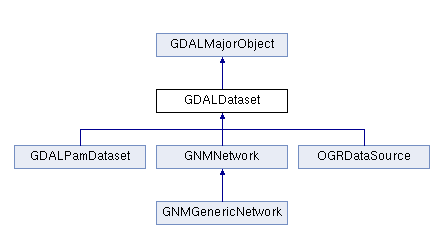
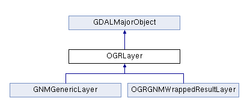

主要介绍GDAL基本类及OGR相关类
<!--more-->
# GDAL 基本使用函数
## CPLSetConfigOption
void CPLSetConfigOption	（	const char * 	pszKey，
const char * 	pszValue 
）		
为GDAL / OGR使用设置配置选项。

这些选项被定义为（键，值）对。稍后可以使用CPLGetConfigOption（）方法获取与密钥对应的值。

此机制类似于环境变量，但使用CPLSetConfigOption（）设置的选项会覆盖CPLGetConfigOption（）的观点，即环境中定义的值。

如果使用相同的密钥多次调用CPLSetConfigOption（），则将使用上次调用期间提供的值。

也可以使用带有'-config KEY VALUE'的大多数GDAL实用程序的命令行传递选项。例如，ogrinfo -config CPL_DEBUG ON~ / data / test / point.shp

此函数也可用于通过传递NULL作为值来清除设置（注意：传递NULL不会取消设置现有环境变量;它将取消设置先前由CPLSetConfigOption（）设置的值）。

例如：
```
CPLSetConfigOption("MDB_DRIVER_TEMPLATE", "DRIVER=Microsoft Access Driver (*.mdb, *.accdb);DBQ=%s");
CPLSetConfigOption("PGEO_DRIVER_TEMPLATE", "DRIVER=Microsoft Access Driver (*.mdb, *.accdb);DBQ=%s");
```

## GDALAllRegister
   最初需要注册所需的所有格式驱动程序。这通常通过调用GDALAllRegister（）来完成，该寄存器注册GDAL / OGR中内置的所有格式驱动程序。 
    原型：  
    ```    
    void GDALAllRegister(void)	
    //Register all known configured GDAL drivers.
    //注册所有已知配置的GDAL驱动程序。
     //This function will drive any of the following that are configured into GDAL. See raster list and vector full list       
    //此功能将驱动配置为GDAL的以下任何内容。请参阅栅格列表和矢量完整列表    
    //This function should generally be called once at the beginning of the application.
    //通常应在应用程序开始时调用此函数一次。 
      
    //使用
    #include“ ogrsf_frmts.h ”
        int main（）
        {
            GDALAllRegister（）;
    ```

## GDALOpenEx
以GDALDataset打开栅格或矢量文件。

此函数将尝试依次调用每个已注册的GDALDriver的Open方法来打开传递的文件或虚拟数据集名称。第一次成功打开将导致返回的数据集。如果所有驱动程序都失败，则返回NULL并发出错误。

几条建议：

+ 如果打开具有GDAL_OF_UPDATE访问权限的数据集对象，则不建议在同一基础文件上打开新数据集。
+ 返回的数据集一次只能由一个线程访问。如果要从不同的线程中使用它，则必须添加所有必需的代码（互斥锁等）以避免并发使用该对象。（某些驱动程序，如GeoTIFF，维护每次读取新块时更新的内部状态变量，从而防止并发使用。）

原型： 
   ```
    GDALDatasetH GDALOpenEx	（	const char * 	pszFilename，
    unsigned int 	nOpenFlags，
    const char * const * 	papszAllowedDrivers，
    const char * const * 	papszOpenOptions，
    const char * const * 	papszSiblingFiles 
    ）
  ```
+ 参数  
    + __pszFilename__	要访问的文件的名称。在外来驱动程序的情况下，这可能不是指物理文件，而是包含驱动程序有关如何访问数据集的信息。它应该是UTF-8编码。
    
    + __nOpenFlags__ GDAL_OF_标志的组合，可以通过逻辑或运算符组合。  
        + 驱动程序类型：用于光栅驱动程序的GDAL_OF_RASTER，用于矢量驱动程序的GDAL_OF_VECTOR，用于地理网络模型驱动程序的GDAL_OF_GNM。如果未指定任何值，则隐含所有类型。
        + 访问模式：GDAL_OF_READONLY（独占）或GDAL_OF_UPDATE。
        + 共享模式：GDAL_OF_SHARED。如果设置，它允许与已设置GDAL_OF_SHARED的其他调用者共享数据集的GDALDataset句柄。特别是，GDALOpenEx（）将首先查询其当前打开和共享GDALDataset的列表，如果一个GetDescription（）名称与传递给GDALOpenEx（）的pszFilename完全匹配，则将引用并返回它，如果GDALOpenEx（）是从同一个线程调用。
        + 详细错误：GDAL_OF_VERBOSE_ERROR。如果设置，则尝试打开文件失败将导致报告错误消息。
    + __papszAllowedDrivers__	NULL考虑所有候选驱动程序，或NULL终止的字符串列表，其中包含必须考虑的驱动程序短名称。
    
    + __papszOpenOptions__	NULL或NULL终止的字符串列表，其中打开选项传递给候选驱动程序。所有驱动程序OVERVIEW_LEVEL = level都存在一个选项，用于选择数据集的特定概述级别。级别索引从0开始。级别编号可以以“仅”为后缀，以指定只有此概述级别必须可见，而不是子级别。默认情况下会验证打开选项，如果无法识别选项，则会发出警告。在某些情况下，可能不需要（例如，当不知道哪个驱动程序将打开文件时），因此可以将特殊打开选项VALIDATE_OPEN_OPTIONS设置为NO以避免此类警告。或者，从GDAL 2.1开始，选项名称前面可以加上@字符，表示如果驱动程序没有声明此选项，它可能不会引发警告。
    
    + __papszSiblingFiles__	NULL或NULL终止的字符串列表，这些字符串是主文件名的辅助文件名。如果传递NULL，则将完成对文件系统的探测。
    
+ 返回
一个GDALDatasetH句柄或失败时为NULL。对于C ++应用程序，此句柄可以转换为GDALDataset *。
   ```
    GDALDataset       *poDS;
    poDS = (GDALDataset*) GDALOpenEx( "point.shp", GDAL_OF_VECTOR, NULL, NULL, NULL );
    if( poDS == NULL )
    {
        printf( "Open failed.\n" );
        exit( 1 );
    }
   ```
使用实例： 
```
GDALDataset       *poDS;
poDS = (GDALDataset*) GDALOpenEx( "point.shp", GDAL_OF_VECTOR, NULL, NULL, NULL );
if( poDS == NULL )
{
    printf( "Open failed.\n" );
    exit( 1 );
}
```

## GDALDataSet
帮助文档https://www.gdal.org/classGDALDataset.html
  
部分函数介绍
+ GetLayerByName
    Fetch a layer by name.
    
    The returned layer remains owned by the GDALDataset and should not be deleted by the application.
    
    This method is the same as the C function GDALDatasetGetLayerByName() and the deprecated OGR_DS_GetLayerByName().
    
    In GDAL 1.X, this method used to be in the OGRDataSource class.
    
    Parameters
    pszName	the layer name of the layer to fetch.
    Returns
    the layer, or NULL if Layer is not found or an error occurs.
+ GetLayerCount
   
# OGR类或函数
## OGRLayer
帮助文档https://www.gdal.org/classOGRLayer.html
  
+ GetLayerDefn
+ GetExtent
+ ResetReading
+ GetNextFeature
+ GetName                                                
## OGRFeature
   包括geometry和attributes
+ GetDefRef
+ GetGeometryRef
   返回指向内部要素几何的指针。不应修改此对象
+ GetFieldAsString 将字段值作为字符串获取
+ OGRFeature::DestroyFeature  
  `void OGRFeature :: DestroyFeature	（	OGRFeature * 	poFeature	）`  
   poFeatur要删除的Feature。
## OGRGeometry
所有几何类的抽象基类。

一些空间分析方法要求在GEOS库上构建OGR才能正常工作。描述几何之间空间关系的方法的精确含义在SFCOM或其他简单特征接口规范中描述，例如“OpenGIS®地理信息实现规范 - 简单特征访问 - 第1部分：通用体系结构”：<a href =“ http://www.opengeospatial.org/standards/sfa “> OGC 06-103r4

在GDAL 2.0中，类的层次结构已经扩展为（工作草案）ISO SQL / MM第3部分（ISO / IEC 13249-3）曲线几何：CIRCULARSTRING（OGRCircularString），COMPOUNDCURVE（OGRCompoundCurve），CURVEPOLYGON（OGRCurvePolygon），MULTICURVE（OGRMultiCurve）和MULTISURFACE（OGRMultiSurface）。
### OGRPoint

### OGRLineString
多顶点线的具体表示。继承OGRSimpleCurve
+ getPoints
`void OGRSimpleCurve::getPoints	(	OGRRawPoint * 	paoPointsOut,double * 	padfZOut = nullptr )	`
+ getPoint
`void OGRSimpleCurve::getPoint	(	int 	i,OGRPoint * 	poPoint )	`
获取行字符串中的一个点。  	
i:要获取的顶点，从0到getNumPoints（） - 1  
poPoint	用获取的点初始化的点。
+ getNumPoints
  获得线上点的个数
### OGRMultiLineString
+ getNumGeometries
  获得几何要素格个数
### OGRPolygon
+ getExteriorRing
   获取对外部多边形环的引用   
+ getNumInteriorRings
  获取指示内部环的数量
+ getInteriorRing
  获取指示内部环的引用
## OGRFeatureDefn
   要素类或要素图层的定义。
   + GetFieldCount 获取字段数
   + GetFieldDefn 获得字段 参数：字段索引
## OGRFieldDefn
   + GetNameRef 字段名称
   
## OGREnvelope
```
class CPL_DLL OGREnvelope
{
  public:
        OGREnvelope() : MinX(std::numeric_limits<double>::infinity()),
                        MaxX(-std::numeric_limits<double>::infinity()),
                        MinY(std::numeric_limits<double>::infinity()),
                        MaxY(-std::numeric_limits<double>::infinity())
        {
        }

        OGREnvelope(const OGREnvelope& oOther) :
            MinX(oOther.MinX),MaxX(oOther.MaxX), MinY(oOther.MinY), MaxY(oOther.MaxY)
        {
        }

    double      MinX;
    double      MaxX;
    double      MinY;
    double      MaxY;

#ifdef HAVE_GCC_DIAGNOSTIC_PUSH
#pragma GCC diagnostic push
#pragma GCC diagnostic ignored "-Wfloat-equal"
#endif
    int  IsInit() const { return MinX != std::numeric_limits<double>::infinity(); }

#ifdef HAVE_GCC_DIAGNOSTIC_PUSH
#pragma GCC diagnostic pop
#endif

    void Merge( OGREnvelope const& sOther ) {
        MinX = MIN(MinX,sOther.MinX);
        MaxX = MAX(MaxX,sOther.MaxX);
        MinY = MIN(MinY,sOther.MinY);
        MaxY = MAX(MaxY,sOther.MaxY);
    }

    void Merge( double dfX, double dfY ) {
        MinX = MIN(MinX,dfX);
        MaxX = MAX(MaxX,dfX);
        MinY = MIN(MinY,dfY);
        MaxY = MAX(MaxY,dfY);
    }

    void Intersect( OGREnvelope const& sOther ) {
        if(Intersects(sOther))
        {
            if( IsInit() )
            {
                MinX = MAX(MinX,sOther.MinX);
                MaxX = MIN(MaxX,sOther.MaxX);
                MinY = MAX(MinY,sOther.MinY);
                MaxY = MIN(MaxY,sOther.MaxY);
            }
            else
            {
                MinX = sOther.MinX;
                MaxX = sOther.MaxX;
                MinY = sOther.MinY;
                MaxY = sOther.MaxY;
            }
        }
        else
        {
            *this = OGREnvelope();
        }
    }

    int Intersects(OGREnvelope const& other) const
    {
        return MinX <= other.MaxX && MaxX >= other.MinX &&
               MinY <= other.MaxY && MaxY >= other.MinY;
    }

    int Contains(OGREnvelope const& other) const
    {
        return MinX <= other.MinX && MinY <= other.MinY &&
               MaxX >= other.MaxX && MaxY >= other.MaxY;
    }
};
```

## OGRwkbGeometryType
几何类型代码。
在下面这类中实现：  
 OGRMultiLineString, OGRMultiCurve, OGRMultiPoint, OGRTriangulatedSurface, OGRPolyhedralSurface, OGRMultiPolygon, OGRMultiSurface, OGRGeometryCollection, OGRTriangle, OGRPolygon, OGRCurvePolygon, OGRCompoundCurve, OGRCircularString, OGRLineString, and OGRPoint.  
 
 常亮值如：wkbPoint，wkbMultiPoint，wkbLineString,wkbMultiLineString，wkbPolygon，wkbCurvePolygon，wkbMultiPolygon
# 参考资料：
1. 百度百科：https://baike.baidu.com/item/GDAL/4004525?fr=aladdin
2. 官方网站：https://www.gdal.org/
