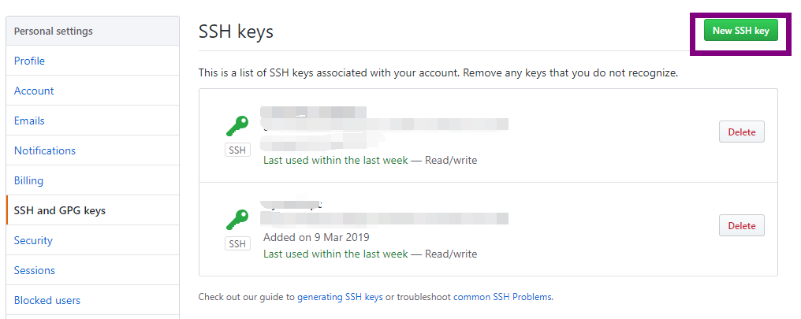
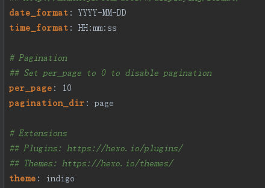

最基础的hexo+github搭建个人博客的教程
<!--more-->
### 一、准备
1. 安装[node.js](https://nodejs.org/en/)
2. 安装[git-windows](https://gitforwindows.org/)
3. 安装hexo-cli
   ```
   $npm install hexo-cli -g
   ```
4. 在GitHub上创建&lt;username&gt;.github.io的仓库
        e.g. 11wy11.github.io
5. 配置SSH key  
   打开本机的控制台，以windows系统为例，可以执行win+R 输入cmd打开，执行
   ```
   ssh-keygen -t rsa -C 'D:/id.txt'
   ```
   然后连续按3次回车，最终会在用户目录下生成一个文件，找到**目录\.ssh/id_rsa.pub**文件，用记事本打开全选复制。   
   在你的github上点击头像>设置进入设置页面，选择SSH and GPG keys, 点击**New SSH key**按钮，名称随意填写，将刚复制的内容粘贴到key,添加
   
### 二、搭建流程
1. 本地创建&lt;username&gt;.github.io
2. 在本地&lt;username&gt;.github.io文件夹下初始化hexo项目并安装依赖
   ```
   hexo init //初始化工程
   npm install //安装依赖
   hexo server //启动本地调试器在localhost:4000预览
   ```
3. 修改默认主题，可以在github上clone其他的主题，如[yilia](https://github.com/litten/hexo-theme-yilia),[icarus](https://github.com/ppoffice/hexo-theme-icarus),[indigo](https://github.com/yscoder/hexo-theme-indigo)等
    * 以indigo为例，在本地&lt;username&gt;.github.io文件夹下执行以下命令安装主题
    ```
     git clone git@github.com:yscoder/hexo-theme-indigo.git themes/indigo  
    ```
    * 修改工程中的_config.yml配置文件，将themes: landscope改为themes: indigo
    
    * 依赖安装分别安装Less,Feed,Json-content依赖，执行如下命令
    ```
    $ npm install hexo-renderer-less --save
    $ npm install hexo-generator-feed --save
    $ npm install hexo-generator-json-content --save
    ```
    * 执行` hexo s `命令启动服务器在localhost:4000查看效果
4. 新建文章，使用hexo new  "my-first blog"，会在source/_posts下创建my-first-blog.md的页面文件
   进行编写
5. 发布博客  
   首先修改工程中的_config.yml配置文件，在最后三行添加以下代码，将username换成自己的git用户名
    ```
    deploy:
      type: git
      repo: git@github.com:<username>/<username>.github.io.git
      branch: master
    ```
    其次安装hexo-deployer-git 执行 `npm install hexo-deployer-git --save`
    在工程文件夹内右键git bash进入命令行 输入hexo g，编译为静态文件，生成public文件夹，使用 hexo d 部署，此时可以访问https://&lt;username&gt;.github.io查看你的博客
6. 备份源码  
    在工程文件夹内右键git bash进入命令行 输入 touch .gitignore ，生成“.gitignore”文件。  
    在”.gitignore” 文件里输入你要忽略的文件夹及其文件就可以了。（注意格式）  
    我的 .gitignore：
     ```
    node_modules/
    .deploy_git
    public/
    .DS_Store 
    Thumbs.db
    db.json  
    *.log
    .deploy*/
     ```
     执行以下命令
     ```git
     #git初始化
     git init
     #创建hexo分支，用来存放源码
     git checkout -b hexo
     #git 文件添加
     git add .
     #git 提交
     git commit -m "init"
     #添加远程仓库
     git remote add origin git@github.com:<username>/<username>.github.io.git
     #push到hexo分支
     git push origin hexo
     ```
    执行hexo g -d生成网站并部署到GitHub上  
    这样一来，在GitHub上的git@github.com:&lt;username&gt;/&lt;username&gt;.github.io.git仓库就有两个分支，一个hexo分支用来存放网站的原始文件，一个master分支用来存放生成的静态网页。
7. 其他设备更新博客步骤：  
    1、先安装hexo   
    $ npm install -g hexo-cli  
    2、存在github上的git clone下来   
    git clone -b hexo git@github.com:&lt;username&gt;/&lt;username&gt;.github.io.git 
    3、项目文件夹下  
    $ npm install 
    $ npm install hexo-deployer-git
    4、重新配置github和coding的公钥  
    5、编写博客push 到远程分支   
### 补充
1. 有时会出现下载的主题无法上传，首先删除themes/主题文件夹下的`.git`,使用` git rm --cached themes/indigo`命令清空后重新上传`
2. 如果最开始.gitignore文件没有配置正确，可以使用`git rm -r --cached .`命令清楚缓存文件，重新add,commit,push上传
3. 当使用node 14以上版本，使用hexo d命令部署时，会提示AGType错误，需要将node的版本退回到12，可以使用nvm管理多个版本的node,具体步骤如下：
   1. 下载nvm(https://github.com/coreybutler/nvm-windows/releases) setup.zip,安装，**注意不要将nvm安装到默认的c/program files下，换一个盘，不然安装node之后会提示node命令找不到**
   2. 在控制台，使用`nvm install node@12.4.0 `命令安装node，可以使用nvm ls 查看当前安装的node版本，使用命令`nvm use 12.4.0`使用指定版本，使用命令node -v 或 npm -v检查安装是否成功
