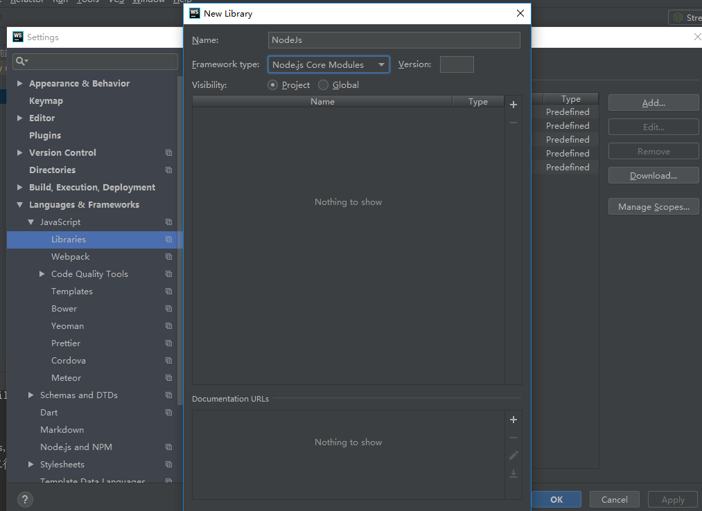

整理来自菜鸟教程中nodejs入门知识

<!--more-->

## 0. Webstorm设置nodejs提示

File>Settings>Languages & Frameworks>javaScript>Libraries, Add Nodejs提示库



## 1. 模块系统

Node.js 中自带了一个叫做 **http** 的模块，我们在我们的代码中请求它并把返回值赋给一个本地变量。

这把我们的本地变量变成了一个拥有所有 http 模块所提供的公共方法的对象。

Node.js 的 require 方法中的文件查找策略如下：

由于 Node.js 中存在 4 类模块（原生模块和3种文件模块），尽管 require 方法极其简单，但是内部的加载却是十分复杂的，其加载优先级也各自不同。如下图所示：


### 1.1 从文件模块缓存中加载

尽管原生模块与文件模块的优先级不同，但是都会优先从文件模块的缓存中加载已经存在的模块。

### 1.2 从原生模块加载

原生模块的优先级仅次于文件模块缓存的优先级。require 方法在解析文件名之后，优先检查模块是否在原生模块列表中。以http模块为例，尽管在目录下存在一个 http/http.js/http.node/http.json 文件，require("http") 都不会从这些文件中加载，而是从原生模块中加载。

原生模块也有一个缓存区，同样也是优先从缓存区加载。如果缓存区没有被加载过，则调用原生模块的加载方式进行加载和执行。

### 1.3 从文件加载

当文件模块缓存中不存在，而且不是原生模块的时候，Node.js 会解析 require 方法传入的参数，并从文件系统中加载实际的文件，这里我们将详细描述查找文件模块的过程，其中，也有一些细节值得知晓。

require方法接受以下几种参数的传递：

- http、fs、path等，原生模块。
- ./mod或../mod，相对路径的文件模块。
- /pathtomodule/mod，绝对路径的文件模块。
- mod，非原生模块的文件模块。

在路径 Y 下执行 require(X) 语句执行顺序：

```javascript
1. 如果 X 是内置模块
   a. 返回内置模块
   b. 停止执行
2. 如果 X 以 '/' 开头
   a. 设置 Y 为文件根路径
3. 如果 X 以 './' 或 '/' or '../' 开头
   a. LOAD_AS_FILE(Y + X)
   b. LOAD_AS_DIRECTORY(Y + X)
4. LOAD_NODE_MODULES(X, dirname(Y))
5. 抛出异常 "not found"

LOAD_AS_FILE(X)
1. 如果 X 是一个文件, 将 X 作为 JavaScript 文本载入并停止执行。
2. 如果 X.js 是一个文件, 将 X.js 作为 JavaScript 文本载入并停止执行。
3. 如果 X.json 是一个文件, 解析 X.json 为 JavaScript 对象并停止执行。
4. 如果 X.node 是一个文件, 将 X.node 作为二进制插件载入并停止执行。

LOAD_INDEX(X)
1. 如果 X/index.js 是一个文件,  将 X/index.js 作为 JavaScript 文本载入并停止执行。
2. 如果 X/index.json 是一个文件, 解析 X/index.json 为 JavaScript 对象并停止执行。
3. 如果 X/index.node 是一个文件,  将 X/index.node 作为二进制插件载入并停止执行。

LOAD_AS_DIRECTORY(X)
1. 如果 X/package.json 是一个文件,
   a. 解析 X/package.json, 并查找 "main" 字段。
   b. let M = X + (json main 字段)
   c. LOAD_AS_FILE(M)
   d. LOAD_INDEX(M)
2. LOAD_INDEX(X)

LOAD_NODE_MODULES(X, START)
1. let DIRS=NODE_MODULES_PATHS(START)
2. for each DIR in DIRS:
   a. LOAD_AS_FILE(DIR/X)
   b. LOAD_AS_DIRECTORY(DIR/X)

NODE_MODULES_PATHS(START)
1. let PARTS = path split(START)
2. let I = count of PARTS - 1
3. let DIRS = []
4. while I >= 0,
   a. if PARTS[I] = "node_modules" CONTINUE
   b. DIR = path join(PARTS[0 .. I] + "node_modules")
   c. DIRS = DIRS + DIR
   d. let I = I - 1
5. return DIRS
```

## 2. 函数传递

在JavaScript中，一个函数可以作为另一个函数的参数。我们可以先定义一个函数，然后传递，也可以在传递参数的地方直接定义函数。

Node.js中函数的使用与Javascript类似，举例来说，你可以这样做：

```javascript
function say(word) {
  console.log(word);
}

function execute(someFunction, value) {
  someFunction(value);
}

execute(say, "Hello");
```

以上代码中，我们把 say 函数作为execute函数的第一个变量进行了传递。这里传递的不是 say 的返回值，而是 say 本身！

这样一来， say 就变成了execute 中的本地变量 someFunction ，execute可以通过调用 someFunction() （带括号的形式）来使用 say 函数。

当然，因为 say 有一个变量， execute 在调用 someFunction 时可以传递这样一个变量。

```javascript
var http = require("http");

http.createServer(function(request, response) {
  response.writeHead(200, {"Content-Type": "text/plain"});
  response.write("Hello World");
  response.end();
}).listen(8888);
```

## 3. 路由

我们要为路由提供请求的 URL 和其他需要的 GET 及 POST 参数，随后路由需要根据这些数据来执行相应的代码。我们需要的所有数据都会包含在 request 对象中，该对象作为 onRequest() 回调函数的第一个参数传递。但是为了解析这些数据，我们需要额外的 Node.JS 模块，它们分别是 url 和 querystring 模块。

```javascript
      url.parse(string).query
                                           |
           url.parse(string).pathname      |
                       |                   |
                       |                   |
                     ------ -------------------
http://localhost:8888/start?foo=bar&hello=world
                                ---       -----
                                 |          |
                                 |          |
              querystring.parse(queryString)["foo"]    |
                                            |
                         querystring.parse(queryString)["hello"]
```

```javascript
var http=require("http");
var url=require("url");
function start(route){
    function onRequest(request,response) {
        // 发送 HTTP 头部
        // HTTP 状态值: 200 : OK
        // 内容类型: text/plain
        var pathname=url.parse(request.url).pathname;
        console.log("Request for " + pathname + " received.");
        route(pathname);
        response.writeHead(200, {'Content-Type': 'text/plain'});
        // 发送响应数据 "Hello World"
        response.end('Hello World\n');
    }
    http.createServer(onRequest).listen(8888);
    // 终端打印如下信息
    console.log('Server running at http://127.0.0.1:8888/');
}
exports.start=start;
```

## 4. 全局变量

### 4.1 Node.js 全局对象

JavaScript 中有一个特殊的对象，称为全局对象（Global Object），它及其所有属性都可以在程序的任何地方访问，即全局变量。

在浏览器 JavaScript 中，通常 window 是全局对象， 而 Node.js 中的全局对象是 global，所有全局变量（除了 global 本身以外）都是 global 对象的属性。

在 Node.js 我们可以直接访问到 global 的属性，而不需要在应用中包含它。

------

### 4.2 全局对象与全局变量

global 最根本的作用是作为全局变量的宿主。按照 ECMAScript 的定义，满足以下条 件的变量是全局变量：

- 在最外层定义的变量；
- 全局对象的属性；
- 隐式定义的变量（未定义直接赋值的变量）。

当你定义一个全局变量时，这个变量同时也会成为全局对象的属性，反之亦然。需要注 意的是，在 Node.js 中你不可能在最外层定义变量，因为所有用户代码都是属于当前模块的， 而模块本身不是最外层上下文。

**注意：** **永远不要使用 var 定义变量以避免引入全局变量，因为全局变量会污染 命名空间，提高代码的耦合风险。**

- __filename
- process
- setTimeout(cb, ms)
- clearTimeout(t)
- setInterval(cb, ms)
- console

## 5. 常用工具

1. inherits

   **util.inherits(constructor, superConstructor)** 是一个实现对象间原型继承的函数。

   JavaScript 的面向对象特性是基于原型的，与常见的基于类的不同。JavaScript 没有提供对象继承的语言级别特性，而是通过原型复制来实现的

   ```javascript
   var util = require('util'); 
   function Base() { 
       this.name = 'base'; 
       this.base = 1991; 
       this.sayHello = function() { 
       console.log('Hello ' + this.name); 
       }; 
   } 
   Base.prototype.showName = function() { 
       console.log(this.name);
   }; 
   function Sub() { 
       this.name = 'sub'; 
   } 
   util.inherits(Sub, Base); 
   var objBase = new Base(); 
   objBase.showName(); 
   objBase.sayHello(); 
   console.log(objBase); 
   var objSub = new Sub(); 
   objSub.showName(); 
   //objSub.sayHello(); 
   console.log(objSub); 
   ```

   **注意：**Sub 仅仅继承了Base 在原型中定义的函数，而构造函数内部创造的 base 属 性和 sayHello 函数都没有被 Sub 继承。

2. isArray

3. inspect

4. isRegExp

5. isDate

6. isError

## 6. 文件系统

### 6.1 异步和同步

```javascript
var fs = require("fs");

// 异步读取
fs.readFile('input.txt', function (err, data) {
   if (err) {
       return console.error(err);
   }
   console.log("异步读取: " + data.toString());
});

// 同步读取
var data = fs.readFileSync('input.txt');
console.log("同步读取: " + data.toString());

console.log("程序执行完毕。");
```

### 6.2 打开文件，读写文件

以下为在异步模式下打开文件的语法格式：

```javascript
fs.open(path, flags[, mode], callback)
```

**参数**

参数使用说明如下：

- **path** - 文件的路径。
- **flags** - 文件打开的行为。具体值详见下文。
- **mode** - 设置文件模式(权限)，文件创建默认权限为 0666(可读，可写)。
- **callback** - 回调函数，带有两个参数如：callback(err, fd)。

flags 参数可以是以下值：

| Flag | 描述                                                   |
| :--- | :----------------------------------------------------- |
| r    | 以读取模式打开文件。如果文件不存在抛出异常。           |
| r+   | 以读写模式打开文件。如果文件不存在抛出异常。           |
| rs   | 以同步的方式读取文件。                                 |
| rs+  | 以同步的方式读取和写入文件。                           |
| w    | 以写入模式打开文件，如果文件不存在则创建。             |
| wx   | 类似 'w'，但是如果文件路径存在，则文件写入失败。       |
| w+   | 以读写模式打开文件，如果文件不存在则创建。             |
| wx+  | 类似 'w+'， 但是如果文件路径存在，则文件读写失败。     |
| a    | 以追加模式打开文件，如果文件不存在则创建。             |
| ax   | 类似 'a'， 但是如果文件路径存在，则文件追加失败。      |
| a+   | 以读取追加模式打开文件，如果文件不存在则创建。         |
| ax+  | 类似 'a+'， 但是如果文件路径存在，则文件读取追加失败。 |


### 6.3  主要方法

| 序号 | 方法 & 描述                                                  |
| :--- | :----------------------------------------------------------- |
| 1    | **fs.rename(oldPath, newPath, callback)** 异步 rename().回调函数没有参数，但可能抛出异常。 |
| 2    | **fs.ftruncate(fd, len, callback)** 异步 ftruncate().回调函数没有参数，但可能抛出异常。 |
| 3    | **fs.ftruncateSync(fd, len)** 同步 ftruncate()               |
| 4    | **fs.truncate(path, len, callback)** 异步 truncate().回调函数没有参数，但可能抛出异常。 |
| 5    | **fs.truncateSync(path, len)** 同步 truncate()               |
| 6    | **fs.chown(path, uid, gid, callback)** 异步 chown().回调函数没有参数，但可能抛出异常。 |
| 7    | **fs.chownSync(path, uid, gid)** 同步 chown()                |
| 8    | **fs.fchown(fd, uid, gid, callback)** 异步 fchown().回调函数没有参数，但可能抛出异常。 |
| 9    | **fs.fchownSync(fd, uid, gid)** 同步 fchown()                |
| 10   | **fs.lchown(path, uid, gid, callback)** 异步 lchown().回调函数没有参数，但可能抛出异常。 |
| 11   | **fs.lchownSync(path, uid, gid)** 同步 lchown()              |
| 12   | **fs.chmod(path, mode, callback)** 异步 chmod().回调函数没有参数，但可能抛出异常。 |
| 13   | **fs.chmodSync(path, mode)** 同步 chmod().                   |
| 14   | **fs.fchmod(fd, mode, callback)** 异步 fchmod().回调函数没有参数，但可能抛出异常。 |
| 15   | **fs.fchmodSync(fd, mode)** 同步 fchmod().                   |
| 16   | **fs.lchmod(path, mode, callback)** 异步 lchmod().回调函数没有参数，但可能抛出异常。Only available on Mac OS X. |
| 17   | **fs.lchmodSync(path, mode)** 同步 lchmod().                 |
| 18   | **fs.stat(path, callback)** 异步 stat(). 回调函数有两个参数 err, stats，stats 是 fs.Stats 对象。 |
| 19   | **fs.lstat(path, callback)** 异步 lstat(). 回调函数有两个参数 err, stats，stats 是 fs.Stats 对象。 |
| 20   | **fs.fstat(fd, callback)** 异步 fstat(). 回调函数有两个参数 err, stats，stats 是 fs.Stats 对象。 |
| 21   | **fs.statSync(path)** 同步 stat(). 返回 fs.Stats 的实例。    |
| 22   | **fs.lstatSync(path)** 同步 lstat(). 返回 fs.Stats 的实例。  |
| 23   | **fs.fstatSync(fd)** 同步 fstat(). 返回 fs.Stats 的实例。    |
| 24   | **fs.link(srcpath, dstpath, callback)** 异步 link().回调函数没有参数，但可能抛出异常。 |
| 25   | **fs.linkSync(srcpath, dstpath)** 同步 link().               |
| 26   | **fs.symlink(srcpath, dstpath[, type], callback)** 异步 symlink().回调函数没有参数，但可能抛出异常。 type 参数可以设置为 'dir', 'file', 或 'junction' (默认为 'file') 。 |
| 27   | **fs.symlinkSync(srcpath, dstpath[, type])** 同步 symlink(). |
| 28   | **fs.readlink(path, callback)** 异步 readlink(). 回调函数有两个参数 err, linkString。 |
| 29   | **fs.realpath(path[, cache], callback)** 异步 realpath(). 回调函数有两个参数 err, resolvedPath。 |
| 30   | **fs.realpathSync(path[, cache])** 同步 realpath()。返回绝对路径。 |
| 31   | **fs.unlink(path, callback)** 异步 unlink().回调函数没有参数，但可能抛出异常。 |
| 32   | **fs.unlinkSync(path)** 同步 unlink().                       |
| 33   | **fs.rmdir(path, callback)** 异步 rmdir().回调函数没有参数，但可能抛出异常。 |
| 34   | **fs.rmdirSync(path)** 同步 rmdir().                         |
| 35   | **fs.mkdir(path[, mode], callback)** S异步 mkdir(2).回调函数没有参数，但可能抛出异常。 访问权限默认为 0777。 |
| 36   | **fs.mkdirSync(path[, mode])** 同步 mkdir().                 |
| 37   | **fs.readdir(path, callback)** 异步 readdir(3). 读取目录的内容。 |
| 38   | **fs.readdirSync(path)** 同步 readdir().返回文件数组列表。   |
| 39   | **fs.close(fd, callback)** 异步 close().回调函数没有参数，但可能抛出异常。 |
| 40   | **fs.closeSync(fd)** 同步 close().                           |
| 41   | **fs.open(path, flags[, mode], callback)** 异步打开文件。    |
| 42   | **fs.openSync(path, flags[, mode])** 同步 version of fs.open(). |
| 43   | **fs.utimes(path, atime, mtime, callback)**                  |
| 44   | **fs.utimesSync(path, atime, mtime)** 修改文件时间戳，文件通过指定的文件路径。 |
| 45   | **fs.futimes(fd, atime, mtime, callback)**                   |
| 46   | **fs.futimesSync(fd, atime, mtime)** 修改文件时间戳，通过文件描述符指定。 |
| 47   | **fs.fsync(fd, callback)** 异步 fsync.回调函数没有参数，但可能抛出异常。 |
| 48   | **fs.fsyncSync(fd)** 同步 fsync.                             |
| 49   | **fs.write(fd, buffer, offset, length[, position], callback)** 将缓冲区内容写入到通过文件描述符指定的文件。 |
| 50   | **fs.write(fd, data[, position[, encoding]], callback)** 通过文件描述符 fd 写入文件内容。 |
| 51   | **fs.writeSync(fd, buffer, offset, length[, position])** 同步版的 fs.write()。 |
| 52   | **fs.writeSync(fd, data[, position[, encoding]])** 同步版的 fs.write(). |
| 53   | **fs.read(fd, buffer, offset, length, position, callback)** 通过文件描述符 fd 读取文件内容。 |
| 54   | **fs.readSync(fd, buffer, offset, length, position)** 同步版的 fs.read. |
| 55   | **fs.readFile(filename[, options], callback)** 异步读取文件内容。 |
| 56   | **fs.readFileSync(filename[, options])**                     |
| 57   | **fs.writeFile(filename, data[, options], callback)** 异步写入文件内容。 |
| 58   | **fs.writeFileSync(filename, data[, options])** 同步版的 fs.writeFile。 |
| 59   | **fs.appendFile(filename, data[, options], callback)** 异步追加文件内容。 |
| 60   | **fs.appendFileSync(filename, data[, options])** The 同步 version of fs.appendFile. |
| 61   | **fs.watchFile(filename[, options], listener)** 查看文件的修改。 |
| 62   | **fs.unwatchFile(filename[, listener])** 停止查看 filename 的修改。 |
| 63   | **fs.watch(filename[, options][, listener])** 查看 filename 的修改，filename 可以是文件或目录。返回 fs.FSWatcher 对象。 |
| 64   | **fs.exists(path, callback)** 检测给定的路径是否存在。       |
| 65   | **fs.existsSync(path)** 同步版的 fs.exists.                  |
| 66   | **fs.access(path[, mode], callback)** 测试指定路径用户权限。 |
| 67   | **fs.accessSync(path[, mode])** 同步版的 fs.access。         |
| 68   | **fs.createReadStream(path[, options])** 返回ReadStream 对象。 |
| 69   | **fs.createWriteStream(path[, options])** 返回 WriteStream 对象。 |
| 70   | **fs.symlink(srcpath, dstpath[, type], callback)** 异步 symlink().回调函数没有参数，但可能抛出异常。 |

## 7. Get/Post请求

### 7.1 获得get请求

```javascript
 function onGetRequest(request,response) {
        // 发送 HTTP 头部
        // HTTP 状态值: 200 : OK
       // 内容类型: text/plain
        var pathname=url.parse(request.url).pathname;
         console.log("Request for " + pathname + " received.");
         route(pathname);
        response.writeHead(200, {'Content-Type': 'text/plain;charset=utf-8'});
        // 发送响应数据 "Hello World"
        // 解析 url 参数
        var params = url.parse(request.url, true).query;
        for(let key in params){
            response.write(key+":"+params[key]+"\n");
        }
        response.end(util.inspect(url.parse(request.url, true)));
    }
  http.createServer(onGetRequest).listen(8888);
```

### 7.2 获得post请求

```javascript
var postHTML =
    '<html><head><meta charset="utf-8"><title> Node.js 实例</title></head>' +
    '<body>' +
    '<form method="post">' +
    '名称： <input name="name"><br>' +
    '邮件： <input name="email"><br>' +
    '地址： <input name="address"><br>' +
    '<input type="submit">' +
    '</form>' +
    '</body></html>';
function onPostRequest(request,response) {
    // 定义了一个post变量，用于暂存请求体的信息
    var post = '';
    request.on('data', function(chunk){
        post += chunk;
    });
    // 在end事件触发后，通过querystring.parse将post解析为真正的POST请求格式，然后向客户端返回。
    request.on('end', function(){
        post = qs.parse(post);
        response.writeHead(200, {'Content-Type': 'text/html; charset=utf8'});
        if(post.name) { // 输出提交的数据
            for(let key in post){
                response.write(key+":"+post[key]+"\n");
            }
        } else {  // 输出表单
            response.write(postHTML);
        }
        response.end();
    });
}
http.createServer(onPostRequest).listen(8888);
```

### 7.3 发送Get请求

```JavaScript
//发送get请求
var http = require('http');

var qs = require('querystring');

var data = {
    a: 123,
    time: new Date().getTime()};//这是需要提交的数据


var content = qs.stringify(data);
var options = {
    hostname: '127.0.0.1',
    port: 8888,
    path: '/pay/pay_callback?' + content,
    method: 'GET'
};

var req = http.request(options, function (res) {
    console.log('STATUS: ' + res.statusCode);
    console.log('HEADERS: ' + JSON.stringify(res.headers));
    res.setEncoding('utf8');
    res.on('data', function (chunk) {
        console.log('BODY: ' + chunk);
    });
});

req.on('error', function (e) {
    console.log('problem with request: ' + e.message);
});

req.end();
```

### 7.4 发送Post请求

```javascript
//发送post
var contents = qs.stringify({
    name:'byvoid',
    email:'byvoid@byvoid.com',
    address:'Zijing'
});

var options = {
    host:'127.0.0.1',
    port:8888,
    path:'/',
    method:'POST',
    headers:{
        'Content-Type':'application/x-www-form-urlencoded',
        'Content-Length':contents.length
    }
}

var req = http.request(options, function(res){
    res.setEncoding('utf8');
    res.on('data',function(data){
        console.log("data:",data);   //一段html代码
    });
});

req.write(contents);
req.end();
```

## 8. 工具模块

| 序号 | 模块名 & 描述                                                |
| :--- | :----------------------------------------------------------- |
| 1    | [**OS 模块**](https://www.runoob.com/nodejs/nodejs-os-module.html) 提供基本的系统操作函数。 |
| 2    | [**Path 模块**](https://www.runoob.com/nodejs/nodejs-path-module.html) 提供了处理和转换文件路径的工具。 |
| 3    | [**Net 模块**](https://www.runoob.com/nodejs/nodejs-net-module.html) 用于底层的网络通信。提供了服务端和客户端的的操作。 |
| 4    | [**DNS 模块**](https://www.runoob.com/nodejs/nodejs-dns-module.html) 用于解析域名。 |
| 5    | [**Domain 模块**](https://www.runoob.com/nodejs/nodejs-domain-module.html) 简化异步代码的异常处理，可以捕捉处理try catch无法捕捉的。 |

## 9. Express框架

- **body-parser** - node.js 中间件，用于处理 JSON, Raw, Text 和 URL 编码的数据。

- **cookie-parser** - 这就是一个解析Cookie的工具。通过req.cookies可以取到传过来的cookie，并把它们转成对象。

- **multer** - node.js 中间件，用于处理 enctype="multipart/form-data"（设置表单的MIME编码）的表单数据。

  ```javascript
  var express=require("express")
  var app=express();
  //  主页输出 "Hello World"
  app.get('/',function (req,res) {
      console.log("主页 GET 请求");
      res.send('hello get');
  })
  //  POST 请求
  app.post('/', function (req, res) {
      console.log("主页 POST 请求");
      res.send('Hello POST');
  });
  //  /del_user 页面响应
  app.get('/del_user', function (req, res) {
      console.log("/del_user 响应 DELETE 请求");
      res.send('删除页面');
  })
  //  /list_user 页面 GET 请求
  app.get('/list_user', function (req, res) {
      console.log("/list_user GET 请求");
      res.send('用户列表页面');
  })
  
  // 对页面 abcd, abxcd, ab123cd, 等响应 GET 请求
  app.get('/ab*cd', function(req, res) {
      console.log("/ab*cd GET 请求");
      res.send('正则匹配');
  })
  app.get('/index.html', function (req, res) {
      res.sendFile( __dirname + "/public/html/" + "index.html" );
  })
  
  var fs = require("fs");
  var multer=require("multer");
  var util = require('util');
  var cookieParser = require('cookie-parser')
  app.use(cookieParser())
  // 创建 application/x-www-form-urlencoded 编码解析
  var urlencodedParser = bodyParser.urlencoded({ extended: false })
  app.use(bodyParser.urlencoded({ extended: false }))
  app.use(multer({dest:'/tmp/'}).array('image'));
  app.post('/process_post', urlencodedParser, function (req, res) {
  
      // 输出 JSON 格式
      var response = {
          "first_name":req.body.first_name,
          "last_name":req.body.last_name
      };
      console.log(response);
       console.log("Cookies: " + util.inspect(req.cookies));
      res.send(JSON.stringify(response));
  })
  var server =app.listen(8081,function () {
      var host=server.address().address;
      var port=server.address().port;
      console.log("应用实例，访问地址为 http://%s:%s", host, port)
  })
  app.post('/file_upload',function (req,res) {
      console.log(req.files[0]);
      var des_file=__dirname+"/"+req.files[0].originalname;
      fs.readFile(req.files[0].path,function (err,data) {
          fs.watchFile(des_file,data,function (err) {
              if(err){
                  console.log(err);
              }else{
                  response={
                      message:'File uploaded successfully',
                      filename: req.files[0].originalname
                  }
              }
              console.log(response);
              res.end(JSON.stringify(response));
          })
  
      })
  })
  ```


## 10. RESTful API

```javascript
/测试restful api
//添加的新用户数据
var user = {
    "user4" : {
        "name" : "mohit",
        "password" : "password4",
        "profession" : "teacher",
        "id": 4
    }
}
app.post('/adduser',urlencodedParser,function (req,res) {
    var newData=req.body;
    fs.readFile(__dirname+"/public/static/users.json","utf-8",function (err,data) {
        data = JSON.parse( data );
        data["user4"] = newData;
        console.log( data );
        res.end( JSON.stringify(data));
    })
})
//  /del_user 页面响应
app.get('/del_user/:id', function (req, res) {
    // First read existing users.
    fs.readFile( __dirname + "/public/static/" + "users.json", 'utf8', function (err, data) {
        data = JSON.parse( data );
        delete data["user" +req.params.id];

        console.log( data );
        res.end( JSON.stringify(data));
    });
})
//  /list_user 页面 GET 请求
app.get('/list_user', function (req, res) {
    console.log("/list_user GET 请求");
    fs.readFile(__dirname+"/public/static/"+"users.json","utf-8",function (err,data) {
        res.end(data);
    })
})
app.get('/:id',function (req,res) {
    // 首先我们读取已存在的用户
    fs.readFile( __dirname + "/public/static/" + "users.json", 'utf8', function (err, data) {
        data = JSON.parse( data );
        var user = data["user" + req.params.id]
        console.log( user );
        res.end( JSON.stringify(user));
    });
})
```

## 11. 多进程

### exec() 方法

child_process.exec

```javascript
const fs = require('fs');
const child_process = require('child_process');

for(var i=0; i<3; i++) {
    var workerProcess = child_process.exec('node support.js '+i, function (error, stdout, stderr) {
        if (error) {
            console.log(error.stack);
            console.log('Error code: '+error.code);
            console.log('Signal received: '+error.signal);
        }
        console.log('stdout: ' + stdout);
        console.log('stderr: ' + stderr);
    });

    workerProcess.on('exit', function (code) {
        console.log('子进程已退出，退出码 '+code);
    });
}
```

### spawn() 方法

```javascript
const fs = require('fs');
const child_process = require('child_process');
for(var i=0; i<3; i++) {
var workerProcess = child_process.spawn('node', ['support.js', i]);
workerProcess.stdout.on('data', function (data) {
console.log('stdout: ' + data);
});
workerProcess.stderr.on('data', function (data) {
console.log('stderr: ' + data);
});
workerProcess.on('close', function (code) {
console.log('子进程已退出，退出码 '+code);
});
}
```

### ork 方法

child_process.fork 是 spawn() 方法的特殊形式，用于创建进程，语法格式如下：

```
child_process.fork(modulePath[, args][, options])
```

```javascript
const fs = require('fs');
const child_process = require('child_process');
for(var i=0; i<3; i++) {
var worker_process = child_process.fork("support.js", [i]);    
worker_process.on('close', function (code) {
console.log('子进程已退出，退出码 ' + code);
});
}
```

## 12. Node.js 连接 MySQL

#### 安装驱动

```
cnpm install mysql
```

#### 连接数据库

```javascript
var mysql      = require('mysql');
var connection = mysql.createConnection({
host     : 'localhost',
user     : 'root',
password : '123456',
database : 'test'
});
connection.connect();
connection.query('SELECT 1 + 1 AS solution', function (error, results, fields) {
if (error) throw error;
console.log('The solution is: ', results[0].solution);
});
```

#### 数据库操作( CURD )

使用connection.query执行sql语句，实现增删改查

```
var mysql=require("mysql");
var connection =mysql.createConnection({
    host:"localhost",
    user:"root",
    password:"123456",
    database:'nodejsBase'
});
connection.connect();
//查询
connection.query('select * from websites',function (error,results) {
    if(error){
        console.log('[SELECT ERROR] - ',error.message);
        return;
    }
    console.log(results);
});
//插入
var  addSql = 'INSERT INTO websites(Id,name,url,alexa,country) VALUES(0,?,?,?,?)';
var  addSqlParams = ['菜鸟工具', 'https://c.runoob.com','23453', 'CN'];
connection.query(addSql,addSqlParams,function (err,result) {
    if(err){
        console.log('[INSERT ERROR] - ',err.message);
        return;
    }
    console.log('--------------------------INSERT----------------------------');
    //console.log('INSERT ID:',result.insertId);
    console.log('INSERT ID:',result);
    console.log('-----------------------------------------------------------------\n\n');
});

//更新
var updateSql='update websites set name=?,url=? where id=?';
var updateParams=['菜鸟移动站', 'https://m.runoob.com',6];
connection.query(updateSql,updateParams,function (err,result) {
    if(err){
        console.log('[UPDATE ERROR] - ',err.message);
        return;
    }
    console.log('--------------------------UPDATE----------------------------');
    console.log('UPDATE affectedRows',result.affectedRows);
    console.log('-----------------------------------------------------------------\n\n');
});
//删除
var deleteSql='delete from websites where id=7';
connection.query(deleteSql,function (err, result) {
    if(err){
        console.log('[DELETE ERROR] - ',err.message);
        return;
    }

    console.log('--------------------------DELETE----------------------------');
    console.log('DELETE affectedRows',result.affectedRows);
    console.log('-----------------------------------------------------------------\n\n');
});
connection.end();
```

### 13. Node.js 连接MongoDB

cnpm install mongodb --save

1. 创建数据库
2. 创建集合
3. 增删改查数据
4. 聚合（连接）操作
5. 删除集合

```javascript
var MongoClient = require('mongodb').MongoClient;
var url = "mongodb://localhost:27017/nodejsBase";
MongoClient.connect(url, { useNewUrlParser: true }, function(err, db) {
    if (err) throw err;
    console.log("数据库已创建!");
    var dbase = db.db("nodejsBase");

    // dbase.createCollection('site', function (err, res) {
    //     if (err) throw err;
    //     console.log("创建集合!");
    //     db.close();
    // });

    var myobj = { name: "菜鸟教程", url: "www.runoob" };
    dbase.collection("site").insertOne(myobj, function(err, res) {
        if (err) throw err;
        console.log("文档插入成功");
        //db.close();
    });
    // myobj =  [
    //     { name: '菜鸟工具', url: 'https://c.runoob.com', type: 'cn'},
    //     { name: 'Google', url: 'https://www.google.com', type: 'en'},
    //     { name: 'Facebook', url: 'https://www.google.com', type: 'en'}
    // ];
    // dbase.collection("site").insertMany(myobj, function(err, res) {
    //     if (err) throw err;
    //     console.log("插入的文档数量为: " + res.insertedCount);
    //     //db.close();
    // });

    //查询全部
    // dbase.collection("site").find({}).toArray(function (err,result) {
    //     if (err) throw err;
    //     console.log(result);
    //     //db.close();
    // })

    //更新
    var whereStr = {"name":'菜鸟教程'};  // 查询条件
    var updateStr = {$set: { "url" : "https://www.runoob.com" ,type:'cn'}};
    dbase.collection("site").updateMany(whereStr,updateStr,function (err,result) {
        console.log("更新————————————————————————");
        if (err) throw err;
        console.log(result.result.nModified + " 条文档被更新");
        //db.close();
    });
    // //条件
    // dbase.collection("site").find({name:"菜鸟教程"}).toArray(function (err,result) {
    //     console.log("查询————————————————————————");
    //     if (err) throw err;
    //     console.log(result);
    //     //db.close();
    // });
    // //删除
    // dbase.collection("site").deleteMany(whereStr, function(err, result) {
    //     console.log("删除————————————————————————");
    //     if (err) throw err;
    //     console.log(result.result.n + " 条文档被删除");
    //     db.close();
    // });
    //查询排序 分页skip 跳过指定条数 limit条数
    // var mysort = { type: 1 };//1升序，-1降序
    // dbase.collection("site").find().sort(mysort).skip(2).limit(5).toArray(function(err, result) {
    //     if (err) throw err;
    //     console.log(result);
    //     db.close();
    // });
    //连接操作
    // dbase.createCollection('orders', function (err, res) {
    //     if (err) throw err;
    //     console.log("创建orders集合!");
    //     db.close();
    // });
    // dbase.createCollection('products', function (err, res) {
    //     if (err) throw err;
    //     console.log("创建products集合!");
    //     db.close();
    // });
    // let orderData={_id:1,product_id:154,status:1}
    // dbase.collection("orders").insertOne(orderData,function (err,result) {
    //     if (err) throw err;
    //     console.log(result.result.n);
    // })
    // let productData=[ { _id: 154, name: '笔记本电脑' },
    //     { _id: 155, name: '耳机' },
    //     { _id: 156, name: '台式电脑' }];
    // dbase.collection("products").insertMany(productData,function (err,result) {
    //     if (err) console.log(err);
    //     console.log(result.result.n);
    // })
    dbase.collection("orders")
        .aggregate([{
            $lookup:
                {
                    from: 'products',            // 右集合
                    localField: 'product_id',    // 左集合 join 字段
                    foreignField: '_id',         // 右集合 join 字段
                    as: 'orderdetails'           // 新生成字段（类型array）
                }
        }])
        .toArray(function(err, res) {
        if (err) throw err;
        console.log(JSON.stringify(res));
        db.close();
    });
    //分组等
    dbase.collection("site")
        .aggregate([{
            $group:{_id:'$name',num:{$sum:1}}
        }])
        .toArray(function(err, res) {
            if (err) throw err;
            console.log(JSON.stringify(res));
            db.close();
        });
    //其他操作类似，查看mongodb操作相关内容
});
```