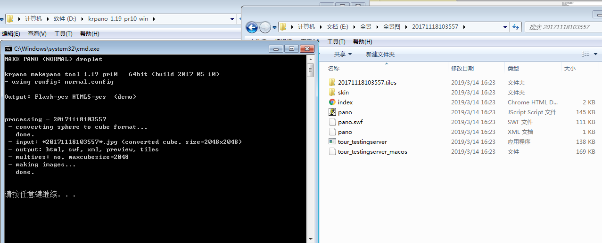
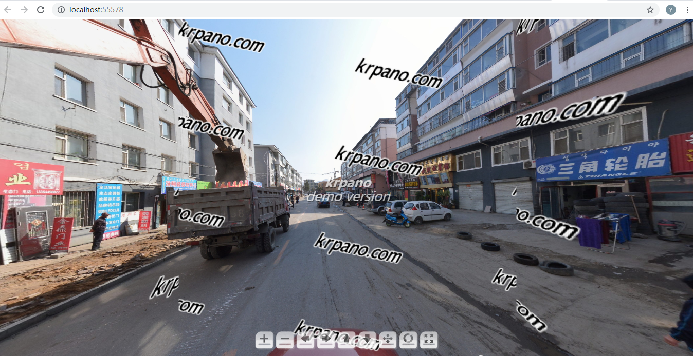
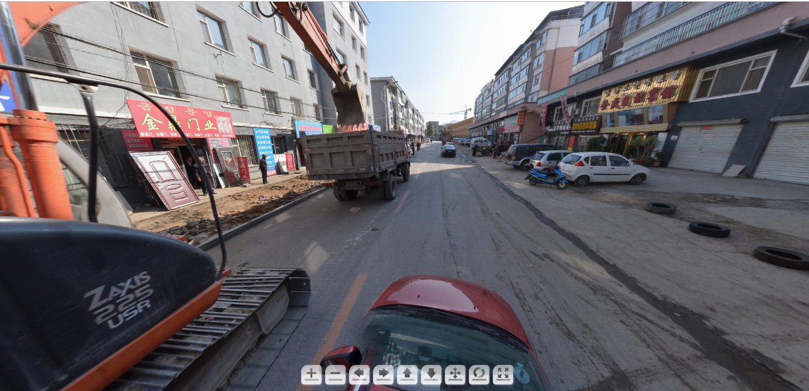

## 使用krpano工具构建即用型panos  
简单使用krpano工具快速生成可执行的pano文件，后续介绍如何自定义编写配置文件切图等
<!--more-->
## krpano简介
Krpano是一款全景漫游制作软件和工具。用krpano所生成的全景，在兼容性、功能性、互动性方面的表现都很不错，而且可以二次开发并拥有自己的编程语言，比如使用专用的krpano xml代码编写全景漫游，可开发出高度定制化的项目。因此，目前主流的全景网站均是在krpano全景的基础上进行开发，并不断进行更新迭代，形成自己独有的全景内容服务。
## 具体步骤
1. 从[krpano下载页面下载](https://krpano.com/download/)适合于自己系统的krpano Tools软件包
2. 将下载的krpano Tools zip文件解压到一个不含中文路径的文件夹下（为了所有稳定使用，推荐）
3. 如果您已拥有krpano许可文件 - 则立即将其复制或移动到krpano Tools文件夹中。如果您没有任何一个，那么只需跳过此步骤即可。之后可以通过注册码注册，具体破解方法请自行百度，注册后能够去掉切片中的krpano水印。
4. 要构建单个全景图 - 打开包含全景图像的文件夹，选择其中一个或全部，拖放到MAKE PANO droplet批处理工具上。 
   
   等待切片完成，会在全景图像所在文件夹中生成一个以全景图命名的文件夹，里面自动生成一个即用型pano,点击tour_testingsever运行测试服务器，打开index.html查看效果。  
   
   需要说明的是，这里如果没有注册，运行之后全景图是有krpano水印的。可以运行krpano tools选择 register now 输入序列号完成注册。注册完在按照第4步操作，得到没有水印的全景图
   
   
注册前

   
   
 注册后

5. 要构建虚拟游览 - 打开包含全景虚拟游览图像的文件夹，选择所有这些图像拖放到MAKE VTOURdroplet批处理工具上。 
6. 其他工具使用类似，主要功能简介如下：  
    * MAKE PANO (NORMAL) droplet  
      针对标准全景图（360度），最大值。cubeize默认限制为2200像素（可以在'templates / normal.config'文件中更改），没有皮肤 - 只需pano，HTML5 iPhone / iPad就绪
    * MAKE PANO（MULTIRES）droplet  
      用于渐进多分辨率的panos，没有尺寸/分辨率限制，快速动态加载，带按钮的默认皮肤，HTML5 iPhone / iPad就绪
    * MAKE PANO（FLAT）droplet  
      用于平面/ 2D平移/图像，平铺多分辨率，无尺寸/分辨率限制，平坦全景/图像的皮肤/控制，仅限闪光
    * MAKE PANO（SINGLESWF）droplet  
      只生成一个Flash swf文件，对于标准全景图，完整的pano将立即加载，最大值。cubesize限制为2200像素（可在'templates / singleswf.config'文件中更改），默认皮肤带按钮，仅限Flash
    * MAKE OBJECT droplet
      用于平铺多分辨率对象影片，一次删除所有对象图像，没有大小/分辨率限制，快速和动态加载，具有按钮和对象旋转控件的对象外观，仅限Flash
    * MAKE VTOUR (NORMAL) droplet / MAKE VTOUR (MULTIRES) droplet
       用于自动构建虚拟游览，将所有全景图像放在此工具上，通过自动缩略图生成，准备好HTML5 iPhone / iPad 
7. 处理完成后关闭dos / terminal窗口。在源图像的文件夹中会有新文件：典型的.html文件 - 这是嵌入pano的示例网页，.swf文件 - 这是krpano Flash查看器，.js文件 - 这是Javascript Flash到HTML嵌入代码（基于swfkrpano.js）和可选的krpano HTML5 / Javascript iPhone / iPad查看器，一个.xml文件 - 这是krpano xml文件，有pano和皮肤定义，最后有.tiles文件夹 - 有处理过的全景图像。全景图像本身不是观看全景图像所必需的。 6.2。当您使用MAKE VTOUR Droplet时，这些文件将位于'vtour'文件夹中，而pano图像位于其中的'panos'文件夹中。
8. 编辑全景设置打开并在任何文本编辑器中编辑生成的xml文件（带有xml-syntax-highlighting的文本编辑器可能会有帮助）： 在在线文档中查找krpano xml定义：
 
