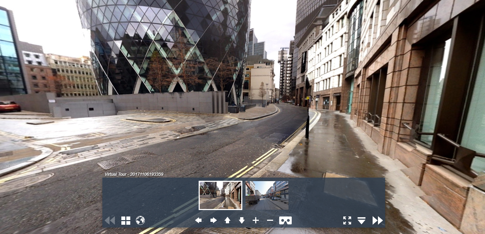

主要介绍全景漫游及vtour文件夹介绍
<!--more-->
### vtour全景漫游及vtour文件夹介绍
使用MAKE VTOUR (MULTIRES) droplet工具生成全景漫游
<!--more-->
### 背景
在初始学习krpano时，可以借助krpano的工具生成全景漫游文件，之后可以根据需要修改tour.xml,定制skin等；
上节简单介绍了krpano使用Make pano的工具创建单场景应用，但大多数应用中场景数量不只一个，彼此之间可以跳转，这就需要借助MAKE VTOUR droplet工具了。而具体选择三种中的哪一种，根据应用场景需要选择，multires支持将全景切片分级，能够达到更好的展示效果，但会使全景文件大小增加，normal生成普通的pano_f.jpg,pano_b.jpg,pano_l.jpg，pano_r.jpg，pano_u.jpg，pano_d.jpg,preview.jpg，分别为全景图的前后左右上下，以及菜单中的预览图。
### 生成vtour
使用MAKE VTOUR (MULTIRES) droplet工具生成的全景漫游场景，场景彼此之间相互连接，能够从一个场景跳转到另一个场景。
可以同时选择多张全景图片拖放在该工具上，输入全景图类型，和全景角度，执行切片，等待完成。显示__done__之后，在全景图文件夹中生成vtour文件夹。
### vtour文件夹内容介绍
	1. tour.html文件--嵌入全景的网页
	2. tour.swf文件--krpano的flash viewer
	3. tour.js文件--基于swfkrpano.js的一个viewer，即HTML5的viewer及嵌入HTML的js文件的合体
	4. tour.xml文件--是krpano xml配置文件，定义全景图配置及皮肤配置
	5. panos文件夹--存放处理后的全景图切片
	6. plugins文件夹--主要存放使用到的插件

### 场景Scene
它们可用于在当前xml文件中再次定义完整krpano xml文件的内容。它就像一个外部的xml，但只是内联/嵌入到当前的xml中。 在调用具有场景名称的loadscene（）

典型的用法是在一个xml文件中定义几个panos。

使用loadpano（）动作加载新的外部xml文件时，将删除所有当前定义的场景元素。

可以在<scene\>元素中存储任何自定义属性 - 查看器本身将忽略它们，但它们可用于自定义操作。
```
<scene name="scene_20171106193359" title="20171106193359" onstart="" thumburl="panos/20171106193359.tiles/thumb.jpg" lat="51.51500000" lng="-0.08050000" heading="0.0">

		<view hlookat="0.0" vlookat="0.0" fovtype="MFOV" fov="120" maxpixelzoom="2.0" fovmin="70" fovmax="140" limitview="range" vlookatmin="-56.055" vlookatmax="56.055" />

		<preview url="panos/20171106193359.tiles/preview.jpg" />

		<image prealign="0|0.0|0">
			<cube url="panos/20171106193359.tiles/pano_%s.jpg" />
		</image>

	</scene>

```
说明：	  
1. name
场景名称，命名规则：每个名字都需要以字母字符开头！这意味着不允许使用数字作为名字！当名称仍然以数字字符开头时，名称将被解释为数组索引。这对于动作内部基于动态索引的访问没有问题，但不能用于定义元素！所有名称将自动转换为小写字母，以便直接区分大小写访问！也是loadscene时设置的参数
2. title
主要显示在缩略图上或者菜单栏名称
3. onstart
 此处可以定义将在“开始时”调用全景/场景观看的任何动作/功能。
场景启动时调用，可以执行定义好的action
4. thumburl
默认视角的展示图路径，使用相对路径，以xml所在位置开始计算相对路径
5. lat&lon
场景所在经纬度，可以用于小地图插件，定位场景
6. heading
仰角度数

### 视图view
view元素包含有关当前视图的信息。
在xml中，它可用于设置启动视图设置。

查找方向将由hlookat / vlookat属性（=水平/垂直lookat）和fov属性中的当前视野定义。要查看部分全景图的限制，可以使用limitview属性。
1. hlookat&vlookat   
设置初始视角，分别为水平方向和垂直方向
	+ hlookat:球面坐标的水平方向，以度为单位。
	        典型范围为-180°至+ 180°。该值不会环绕360°，但视图本身会。值0.0指向全景图像的中心。
	+ vlookat:球面坐标的垂直方向，以度为单位。
	        典型范围为-90°至+90°。但视图本身会。值0.0指向全景图像的中心。
2. fov  
  以度为单位的当前视野 - 从近似0.0到179.0。,默认为90 
3. fovmin&fovmax  
  主要设置视角放大和缩小的最大和最小视角
4. maxpixelzoom
   全景图像的最大像素缩放系数。  
   这将根据全景分辨率和当前观察窗口自动限制fov，例如1.0 =限制为100％缩放，不会看到源图像的像素缩放。

### 预览preview
    url:设置预览图路径
### 全景图image
    使用<image>元素将定义全景图像。
在此处设置图像/图块的类型，大小和URL路径。
1. type  
定义全景图像的类型。

可能的值：
+ CUBE
方全景图像 - 六个图像，每个立方体一个图像。
+ CUBESTRIP
在一张图像中作为“图像条”的立方体全景图像。支持的多维数据集格式为6x1,1x6,3x2或2x3。立方体侧对齐本身始终需要：L，F，R，B，U，D（默认为krpano）。
+ SPHERE
球形/ equirectangular全景图像。
通过设置自定义hfov， vfov和 voffset设置可以实现部分panos。
+ CYLINDER
一个圆柱形全景图像。
通过设置自定义hfov， vfov和 voffset设置可以实现部分panos。
+ ...未设置时：
如果未设置类型，则查看器会尝试通过<image\>标记内的标记自动检测类型（仅适用于非多图像）。

2. hfov
以度为单位定义全景图像的水平视野（hfov）。
这是在全景图像上捕获的可见范围。
默认值为360，表示全方位视图。使用较小的值进行部分全景。对于平坦全景（或普通图像），应使用值“1.0”。
3. multies
   启用平铺的多分辨率图像。
   设置为true时，<image\>元素需要包含多个<level\>元素，其中包含每个多分辨率级别的图像定义。多分辨切片时定义使用

4. tilesize
   当全景图为切片时，设置每一级切片大小
5. level[..].tiledimagewidth level[..].tiledimageheight
某一级切片大小
6. stereo&stereolabels&stereoformat	

	允许使用立体图像（仅限HTML5和WebGL）。

	使用立方体图像时，图像URL应包含％t占位符。此占位符将替换为stereolabels设置中的值。对于左图像，将使用第一个值，对于右图像，将使用第二个值。

	对于球形或圆柱形图像或视频，可以使用“帧封装”立体图像。该stereoformat设置定义的打包顺序：
	stereoformat =“TB” - 上/下
	stereoformat =“SBS” - Side-By-Side
	示例 - 立体立方体图像：
```
<image stereo =“true”stereolabels =“1 | 2” > 
  <cube url =“pano_％s_ ％t .jpg”/> 
</ image>
示例 - 立体全景视频：
<image stereo =“true”stereoformat =“TB” > 
  <sphere url =“ plugin：video ”/> 
</ image>
```
	注意 - 根据全景图像或视频的像素大小（和侧面），可能需要手动设置hfov，vfov和voffset设置。

7. fisheye.fov fisheye.align fisheye.crop fisheye.lenscp 
	鱼眼图像支持（仅限HTML5和WebGL）。

	通过鱼眼设置，可以在krpano中使用鱼眼照片和视频。

	为了正确地拉直和对齐鱼眼图像，有必要了解一些有关它的参数。获取这些参数的一个好工具是PTGUI。

	鱼眼设置：
	+ fov = “180.0”
		+ 鱼眼图像的视野（以度为单位）。
		+ 与crop大小有关。
		+ 来源：可以直接从PTGUI fov图像参数中获取。
	+ align = “yaw|pitch|roll”
		+ 图像的对齐/旋转/调平（以度为单位）。
		+ 来源：可以直接从PTGUI图像参数中获取。
		（例如，使用垂直线控制点来对齐/调整图像）
	+ crop=“left|right|top|bottom”
		+ 鱼眼fov裁剪圆的边缘（以像素为单位）。
		+ 圆与fov大小有关。
		+ 来源：可以直接从PTGUI裁剪设置中获取。
	+ lenscp = “a| b | c | d | e” 的
		+ 镜头校正参数。
		+ 来源：可以直接从PTGUI镜头设置中获取。

### image中URL占位符等
根据图像类型和相关设置，图像的URL应包含多个占位符，以允许寻址正确的图像文件。

这些网址占位符可用：
+ 对于立方体的各个面：％s⇒cubelabels的占位符
+ 对于水平图块索引：％h，％x，％u或％c （都相同）
+ 对于垂直图块索引： ％v，％y或％r （都相同）
+ 对于立体图像：％t⇒stereolabels的占位符
为当前图像帧：％f ⇒ image.frame （仅限Flash）
+ 每个占位符可以在url中多次使用 - 例如，作为文件名的一部分，也作为foldername的一部分。
+ 平铺索引填充：
通过在％字符和tile-index占位符的字符之间插入一个或多个0个字符，可以为数字定义自定义填充。  
比如:  
％H  ⇒  1,2,3，...，9,10,11   
％0H  ⇒  01,02,03，...，09,10,11   
％00H  ⇒  001,002,003，......，009010011

### 预览效果

### 补充
之后的主要工作为：定制skin，定制plugins，定制xml，一些动态操作全景图配置使编辑js文件，能够实现动态配置全景图程序，能够更好的融入到Web应用程序中，作为其中一个子功能模块。后续结合实际案例介绍具体实现方式。历史文章
### 历史文章
[krpano快速入门教程（一) 使用krpano工具构建即用型panos](/2019/03/14/krpano-first-note)
