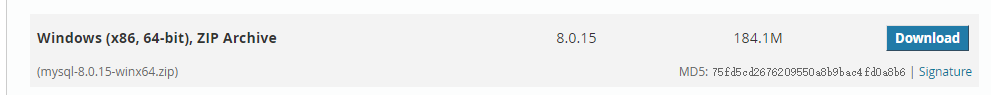
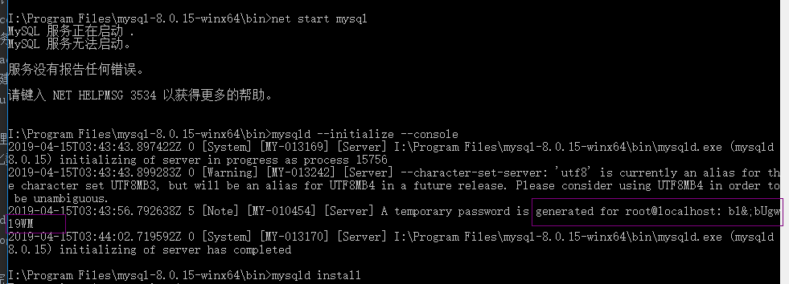

使用archive 解压版安装
<!--more-->
# 下载安装包
1. 在window安装MySQL,[MySQL下载](https://dev.mysql.com/downloads/mysql/)  
在页面最下方找到ZIP Archive
  
2. 将文件解压到你想安装的位置
3. 在解压文件夹__I:\Program Files\mysql-8.0.15-winx64__下，创建__my.ini__,配置以下信息  
   ```
    [mysql]
    # 设置mysql客户端默认字符集
    default-character-set=utf8
     
    [mysqld]
    # 设置3306端口
    port = 3306
    # 设置mysql的安装目录
    basedir=I:\\Program Files\\mysql-8.0.15-winx64
    # 设置 mysql数据库的数据的存放目录，MySQL 8+ 不需要以下配置，系统自己生成即可，否则有可能报错
    # datadir=C:\\web\\sqldata
    # 允许最大连接数
    max_connections=20
    # 服务端使用的字符集默认为8比特编码的latin1字符集
    character-set-server=utf8
    # 创建新表时将使用的默认存储引擎
    default-storage-engine=INNODB
   ```
4. 以管理员身份打开 cmd 命令行工具，切换目录：
   初始化数据库：
   ```
   >>i:
   I:>>cd I:\Program Files\mysql-8.0.15-winx64\bin
   I:\Program Files\mysql-8.0.15-winx64\bin>> mysqld --initialize --console
   ```
   执行完成后，会输出 root 用户的初始默认密码，如：
   
   bl&;bUgwl9WM就是初始密码，后续登录需要用到，你也可以在登陆后修改密码。
   
   输入以下安装命令：
   ```
   mysqld install

   ```
   启动输入以下命令即可：
   ```
   net start mysql
   ```
# 登录MySQL
  当 MySQL 服务已经运行时, 我们可以通过 MySQL 自带的客户端工具登录到 MySQL 数据库中, 首先打开命令提示符, 输入以下格式的命名:
  ```
  mysql -h 主机名 -u 用户名 -p
  ```
  参数说明：
  
  - -h : 指定客户端所要登录的 MySQL 主机名, 登录本机(localhost 或 127.0.0.1)该参数可以省略;
  - -u : 登录的用户名;
  - -p : 告诉服务器将会使用一个密码来登录, 如果所要登录的用户名密码为空, 可以忽略此选项。
  
  若密码存在, 输入密码登录, 不存在则直接按回车登录。登录成功后你将会看到 Welecome to the MySQL monitor... 的提示语。
  
  然后命令提示符会一直以 mysq> 加一个闪烁的光标等待命令的输入, 输入 exit 或 quit 退出登录。
  
# 修改默认密码
  进入数据库后，执行
  ```
    update user set password=password("新密码") where user="root"
  ```
# 设置环境变量更方便的启动和停止等
  右键我的电脑->属性->高级系统设置->环境变量->path->编辑，将你的mysql软件下的bin目录的全路径放里面。  
   最后在那个目录的路径后面加个英文的分号（;）保存就行了。如D:\mysql\mysql-x.x.xx-winx64\bin;
# 其他常用命令
  ```
    show databases;//查看数据库
    use 数据库名;//切换数据库目录
    show tables;//查看表
    select * from 表名;//sql查询
    exit 退出
   ```
# 常见问题及解决方案
  1. navicat连接mysql8后报1251的错误
     【解决方案1】：
     原因：
     在网上查的是,出现这个原因是mysql8 之前的版本中加密规则是mysql_native_password,而在mysql8之后,加密规则是caching_sha2_password,   
     解决问题方法有两种,一种是升级navicat驱动,一种是把mysql用户登录密码加密规则还原成mysql_native_password.  
     第二种：   
     ALTER USER 'root'@'localhost' IDENTIFIED BY 'password' PASSWORD EXPIRE NEVER; #修改加密规则     
     ALTER USER 'root'@'localhost' IDENTIFIED WITH mysql_native_password BY 'password'; #更新一下用户的密码   
     FLUSH PRIVILEGES; #刷新权限   
          


