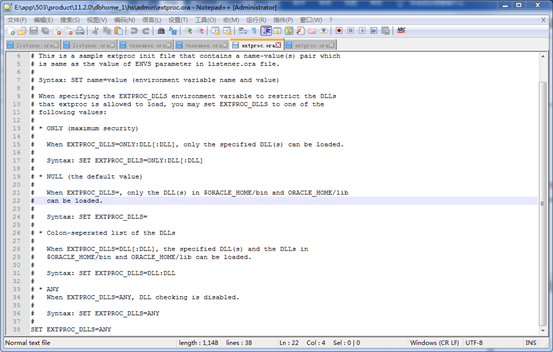
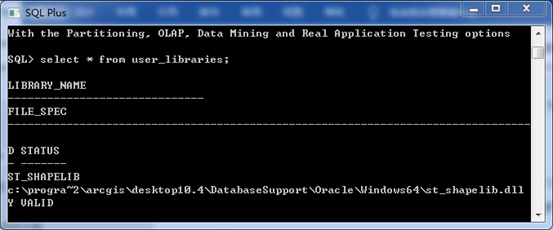
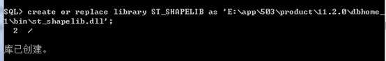
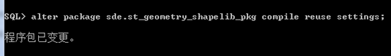

 Oracle配置SDE支持空间查询,配置oracle外部链接库
<!--more-->
### 配置oracle外部链接库
1. 将ArcGIS Desktop安装目录下DatabaseSupport文件夹下的st_shapelib.dll拷贝到装有oracle的服务器上，可以放置在任意地方，这里推荐放在Oracle安装目录下的bin文件夹下。  
    例如：st_shapelib.dll所在文件夹路径：
    C:\ProgramFiles(x86)\ArcGIS\Desktop10.2\DatabaseSupport\Oracle\Windows64\st_shapelib.dll
    拷贝放置位置：E:\app\503\product\11.2.0\dbhome_1\BIN\ st_shapelib.dll
2. 修改oracle安装目录下的network/admin文件夹下的listener.ora,将步骤1中的st_shapelib.dll路径添加到
   ENVS"EXTPROC_DLLS=ONLY:E:\app\503\product\11.2.0\dbhome_1\bin\oraclr11.dll;后面
        例如：linstener文件，添加红色字部分
    ``` ora
    # listener.ora Network Configuration File: D:\app\Administrator\product\11.2.0\dbhome_1\NETWORK\ADMIN\listener.ora
    # Generated by Oracle configuration tools.
    SID_LIST_LISTENER =
      (SID_LIST =
        (SID_DESC =
          (SID_NAME = CLRExtProc)
          (ORACLE_HOME = E:\app\503\product\11.2.0\dbhome_1)
          (PROGRAM = extproc)
          (ENVS= "EXTPROC_DLLS=ONLY:E:\app\503\product\11.2.0\dbhome_1\bin\oraclr11.dll;E:\app\503\product\11.2.0\dbhome_1\bin\st_shapelib.dll") # interesting
        )
      )   
    LISTENER =
      (DESCRIPTION_LIST =
        (DESCRIPTION =
          (ADDRESS = (PROTOCOL = TCP)(HOST = 503-PC)(PORT = 1521))
    	  (ADDRESS = (PROTOCOL = IPC)(KEY = EXTPROC1521))
        )
        (DESCRIPTION =
          (ADDRESS = (PROTOCOL = TCP)(HOST = 192.168.1.164)(PORT = 1521))
        )
      )
     
    ADR_BASE_LISTENER = E:\app\503
    ```
3. 修改oracle安装home目录下的hs/admin文件夹下的extproc.ora，具体路径示例：E:\app\503\product\11.2.0\dbhome_1\hs\admin\extproc.ora，将最后一行的SET EXTPROC_DLLS=  设为ANY
   
4. 通过任何一个数据库管理软件，这里以sql-plus为例，使用sde用户登录首先执行：`select * from user_libraries`
	查看是否有ST_SHAPELIB并检查路径是否与步骤1中的一致，通常默认为c盘第一次安装Arcgis时的相关路径。结果如下：
	 
	 如果路径与步骤1中st_shapelib的路径不一致，执行以下两条命令：
	 + Create or replace library st_SHAPELIB  as <步骤1中的st_shapelib路径>
	  
     + Alter package sde.st_geometry_shapelib_pkg compile reuse settings
     
5. 重启监听器OracleOraDB11g_home1TNSListener，有时也需要重启服务OracleServiceORCL。


