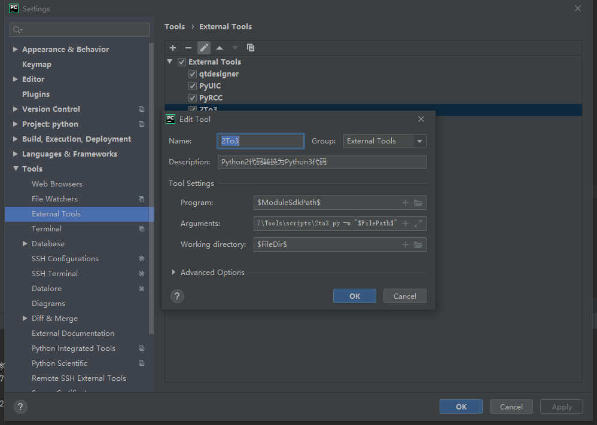
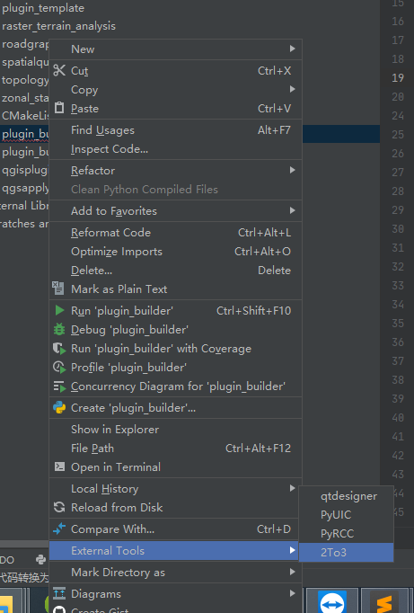

<!--more-->

记录：破解激活文档：https://www.cnblogs.com/xuexianqi/p/12767075.html

# 【Python】在PyCharm的菜单栏中配置Python2代码转换Python3的工具

概述
本文介绍如何在PyCharm环境配置2to3.py工具到菜单栏。

测试环境
Windows 10 64位
PyCharm Community Edition 2016.3
Python 3.5.1

### 2to3.py

如果要把python2编译器下的代码转换升级到python3编译器，可以使用Python自带的2to3.py工具进行转化。

你可以在Python安装路径下的Tools\scripts目录下找到2to3.py文件。

命令行使用方式：

python C:\Python35\Tools\scripts\2to3.py -w [filename]

可以加-h查看帮助：

python C:\Python35\Tools\scripts\2to3.py -h

### 配置步骤

第一步：
pyCharm菜单栏–>「File」–>「Settings」–>「Tools」–>「External Tools」–>点击加号添加工具。

第二步：
工具配置如下：

Program：\$ModuleSdkPath\$
Parameters：C:\Python35\Tools\scripts\2to3.py -w "\$FilePath\$"
Working directory：\$FileDir\$

第三步：
之后一路「OK」即可，完成后可以在「菜单栏」–>「Tool」–>「Extern Tools」下使用。

注意事项
由于Markdown编辑器的原因，参数以图片为准。
2to3.py存放路径最好不要有空格，或者尝试给执行路径加英文双引号，例如：
"C:\Python37\Tools\scripts\2to3.py" -w "\$FilePath\$"

#### 参考：https://blog.csdn.net/yannanxiu/article/details/54601075

