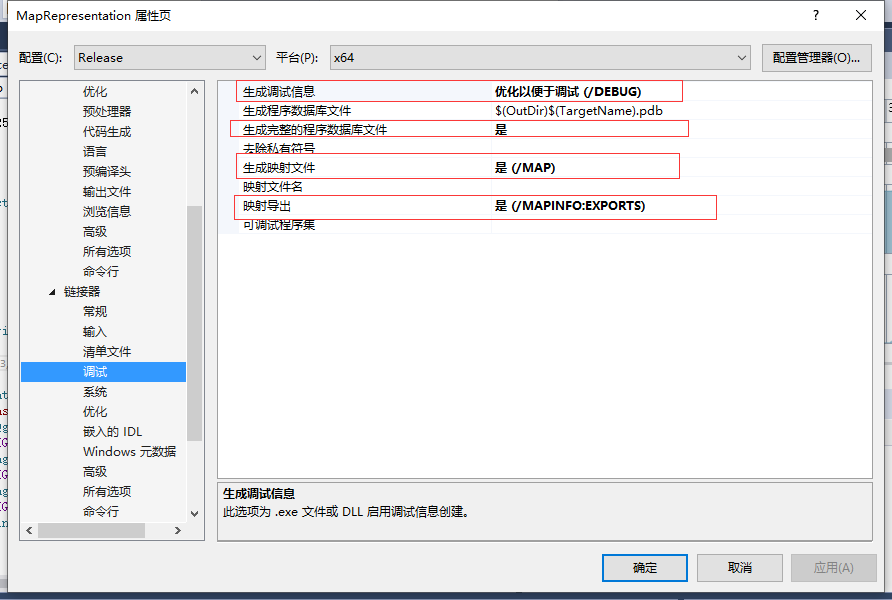
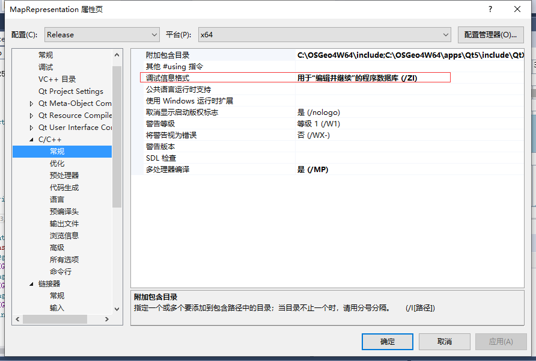
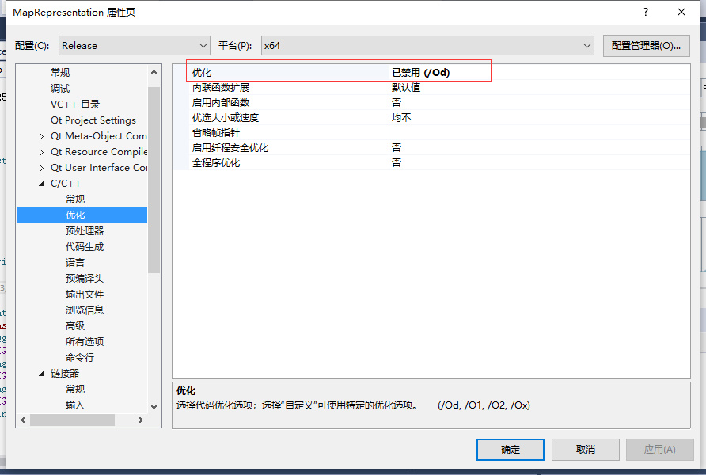

结合网上资料以及自己的尝试，整理一个搭建环境的详细步骤

<!--more-->

### 基本软件下载

#### 1.OSGeo4W下载

OSGeo4W  http://download.osgeo.org/osgeo4w/osgeo4w-setup-x86.exe (32bit) or http://download.osgeo.org/osgeo4w/osgeo4w-setup-x86_64.exe (64bit)

选择Advance Install ,在线下载时，使用镜像http://gwmodel.whu.edu.cn/mirrors/osgeo4w，不然会下载特别缓慢

#### 2. QT5

会在安装qgis的时候，同时下载QT5.11.2，默认安装路径为：C:\OSGeo4W64\apps\Qt5

#### 3.VS2015安装QT插件

##### 方式一：通过工具》扩展与更新》联机，搜索QT，但在新建QT工程时，只有QTWidgetsApplication,没有QTGUIApplication，想使用QT GUI Application模板创建，则卸载方式一安装的插件

##### 方式二：

进入下边网站下载，点击安装即可。（本次下载的是2.4.3）

https://download.qt.io/official_releases/vsaddin/2.4.3/

#### VS 创建QT工程

新建项目，C++下QT,使用QT GUI Application模板创建，勾选XML。，经过测试，直接使用方式一安装的插件，创建QT WidgetsApplication也可以

#### 配置项目属性

1.**C/C++下，附加包含目录**，设置qt相关的include，以及OSGeo4W，QGIS的include目录

```
C:\OSGeo4W64\include;C:\OSGeo4W64\apps\Qt5\include\QtXml;C:\OSGeo4W64\apps\Qt5\include\QtWidgets;C:\OSGeo4W64\apps\Qt5\include\QtGui;C:\OSGeo4W64\apps\qgis\include;%(AdditionalIncludeDirectories)
```

2.链接器，设置附加库目录

```
C:\OSGeo4W64\apps\Qt5\lib;C:\OSGeo4W64\apps\qgis\lib;%(AdditionalLibraryDirectories)
```

3.链接器下，输入，设置附加依赖项

```
qgis_core.lib;qgis_app.lib;qgis_gui.lib;Qt5Widgets.lib;Qt5Xml.lib;%(AdditionalDependencies)
```

4.在项目工程目录下，与EXE同级目录下，**将OSGeo4W的bin,apps/qgis/bin,apps/QT5/bin下的所有dll拷贝到exe同级目录。**


5.将qt中plugins拷贝到4所述的路径下，否则编译会报错，提示no QT Platform的错误，如果不知道，就都拷，考虑到项目大小，使用**其他QT工程自动拷贝dll的方法**，自动添加qt拷贝


 

#### 其他QT工程自动拷贝dll的方法

在当前工程的exe目录下，**可以在按住shift,右键Release目录，选择在powershell窗口打开**,执行以下命令：QtGuiApplication1为创建的qt工程项目

`C:\OSGeo4W64\apps\Qt5\bin\windeployqt.exe QtGuiApplication1.exe`

#### 运行第一个QGIS项目找不到M_PI

主要是C++默认不包含科学库，需要设置预处理器，、、、、


### 第一个qgis项目

1.在main.app中改QtApplication的主函数为QgisApplication

```c++
#include "QtGuiApplication1.h"
#include <QtWidgets/QApplication>
#include <qgsapplication.h>

int main(int argc, char *argv[])
{
	/*QApplication a(argc, argv);
	QtGuiApplication1 w;
	w.show();
	return a.exec();*/
	QgsApplication a(argc, argv, true);
	QgsApplication::setPrefixPath("C:/OSGeo4W/apps/qgis", true);
	QgsApplication::initQgis();    //初始化QGIS应用
	QtGuiApplication1 w;
	w.show();

	return a.exec();
}
```

2.在窗体主文件中，头文件，定义mapcanvas，以及图层

```c++
#pragma once

#include <QtWidgets/QMainWindow>
#include "ui_QtGuiApplication1.h"
#include <qmenu.h>
#include <qaction.h>
#include <qgsmapcanvas.h>

class QtGuiApplication1 : public QMainWindow
{
	Q_OBJECT

public:
	QtGuiApplication1(QWidget *parent = Q_NULLPTR);

private:
	Ui::QtGuiApplication1Class ui;
	// create the menus and then add the actions to them.
	QMenu *fileMenu;
	QAction *openFileAction;

	//map canvas
	QgsMapCanvas *mapCanvas;
	QList<QgsMapLayer *> layers;

	public slots:
	void on_openFileAction_triggered();
	//

public:
	void addVectorLayer();

};
```

3.cpp文件中

```c++
#include "QtGuiApplication1.h"
#include <qmenubar.h>
#include <qmessagebox.h>
#include <qfiledialog.h>
#include <qgsvectorlayer.h>

QtGuiApplication1::QtGuiApplication1(QWidget *parent)
	: QMainWindow(parent)
{
	ui.setupUi(this);
	this->resize(600, 400);

	// create the menus and then add the actions to them.
	fileMenu = this->menuBar()->addMenu("File");
	openFileAction = new QAction("Open", this);
	this->connect(openFileAction, SIGNAL(triggered(bool)), this, SLOT(on_openFileAction_triggered()));
	fileMenu->addAction(openFileAction);

	// initialize the map canvas
	mapCanvas = new QgsMapCanvas();
	this->setCentralWidget(mapCanvas);

	mapCanvas->setCanvasColor(QColor(255, 255, 255));
	mapCanvas->setVisible(true);
	mapCanvas->enableAntiAliasing(true);
}
void QtGuiApplication1::on_openFileAction_triggered() {
	addVectorLayer();
}

void QtGuiApplication1::addVectorLayer()
{
	QString fileName = QFileDialog::getOpenFileName(this, tr("Open shape file"), "", "*.shp");
	QStringList temp = fileName.split('/');
	QString basename = temp.at(temp.size() - 1);
	QgsVectorLayer* vecLayer = new QgsVectorLayer(fileName, basename, "ogr");

	if (!vecLayer->isValid())
	{
		QMessageBox::critical(this, "error", QString("layer is invalid: \n") + fileName);
		return;
	}
	mapCanvas->setExtent(vecLayer->extent());
	layers.append(vecLayer);
	mapCanvas->setLayers(layers);
	mapCanvas->refresh();
}
```

### 可能遇到的错误及解决

#### 1、提示qgis相关库找不到，


**解决方案：**,将qgis/bin下dll拷贝到项目编译后exe所在目录

同理，可能会提示找不到OSGeo4W下例如gdal,sqlite3等库dll,将OSGeo4W/bin下dll拷贝到项目编译后exe所在目录

#### 2.Release版本可以运行，但在Debug模式，新建地图画布mapcanvas报错

将include和lib,使用qgis-dev路径下的文件

其次，如果在debug模式下编译提示无法找到某个dll,也可以在网上下载提示的dll，像gdal303.dll，在app/gdal-dev中，proj_8_0.dll，在proj-dev里

#### 3.warning C4003 引入头文件顺序错误

```
1>d:\osgeo4w64\apps\qgis\include\qgsdatetimestatisticalsummary.h(148): warning C4003: “min”宏的实参不足 (编译源文件 MapRepApp.cpp)
```

c/c++ **附加包含目录中定义的目录顺序有关，尝试调整相关库顺序**

**<windows.h>头文件中的宏 min(或者max)与QT的类QTimer 中的宏min(或者max)冲突**

#### 4.error C3646未知重写说明符

1.h 1.cpp

2.h 2.cpp

在1.h 中#include了 2.h ，然后在2.h 中又#include了 1.h ，然后这个错误就出现了

**出现这个提示，一般情况是：①本错误所在文档加载的某个头文件中，文件的最后缺失了一个分号。②缺少定义，未包含相应的头文件；③类的定义的先后顺序有误**

#### 5.dll链接不一致不允许定义dllimport静态数据成员


### QGIS 二次开发在Release模式开发使用断点

1. 链接器》调试，设置生成调试信息，生成完整程序数据库文件，生成映射文件，即时导出，如下图所示

   

2. 设置C/C++常规调试信息格式：用于“编辑并继续”的程序数据库

   

3. 设置C/C++ 优化：已禁用

