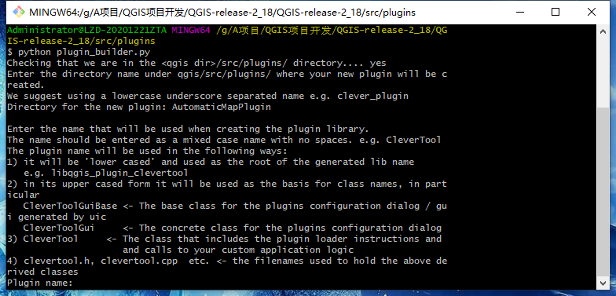
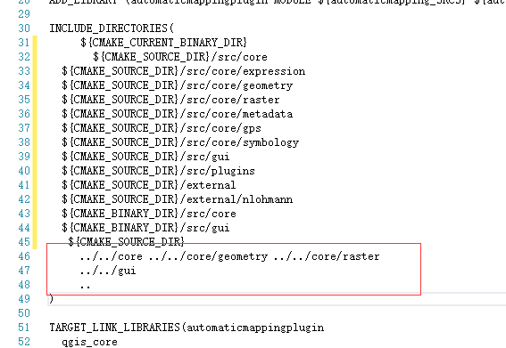
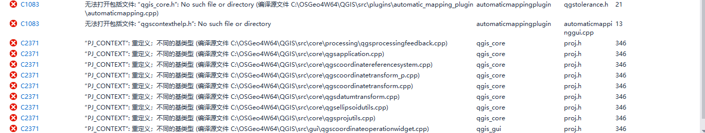

<!--more-->

# QGIS C++插件开发

首先下载QGIS 2.18版本的源码，在src/plugins下找到Plugin_builder.py

**转换Plugin_builder.py的语法**

**因为我正式编译的QGIS源码版本是3.16，QGIS在3.x版本之后使用Python3，而原本旧版本中自带的plugin_builder语法是Python2的因此需要转换，**

python2ToPython3 参见：配置pycharm

### 创建plugin源码工程

运行命令：`python plugin_builder.py`



参数摘要：
插件目录：我_插件
插件名称：MyTool
插件的描述：例如
插件的类别：Plugins
菜单名称：我的工具
菜单项名称：我的插件

**将生成的插件放在3.16源码src/plugin下**

**修改CMakeLists.txt 将QT4相关内容改为Qt5**

```

########################################################
# Files

SET (automaticmapping_SRCS
     automaticmapping.cpp
     automaticmappinggui.cpp
)

SET (automaticmapping_UIS automaticmappingguibase.ui)

SET (automaticmapping_MOC_HDRS
     automaticmapping.h
     automaticmappinggui.h
)

SET (automaticmapping_RCCS  automaticmapping.qrc)

########################################################
# Build

QT5_WRAP_UI (automaticmapping_UIS_H  ${automaticmapping_UIS})

QT5_WRAP_CPP (automaticmapping_MOC_SRCS  ${automaticmapping_MOC_HDRS})

QT5_ADD_RESOURCES(automaticmapping_RCC_SRCS ${automaticmapping_RCCS})

ADD_LIBRARY (automaticmappingplugin MODULE ${automaticmapping_SRCS} ${automaticmapping_MOC_SRCS} ${automaticmapping_RCC_SRCS} ${automaticmapping_UIS_H})

INCLUDE_DIRECTORIES(
     ${CMAKE_CURRENT_BINARY_DIR}
     ../../core ../../core/geometry ../../core/raster
     ../../gui
     ..
)

TARGET_LINK_LIBRARIES(automaticmappingplugin
  qgis_core
  qgis_gui
)


########################################################
# Install

INSTALL(TARGETS automaticmappingplugin
  RUNTIME DESTINATION ${QGIS_PLUGIN_DIR}
  LIBRARY DESTINATION ${QGIS_PLUGIN_DIR})


```

****

重新通过CMake-gui编译工程

按照我之前的教程2.4

[教程]: https://11wy11.github.io/2020/12/22/qgis-develop-5

打开visio studio 开始编译插件

### 修改CMakeList文件

修改INCLUDE_DIRECTORIES

将原本的相对路径../../core

换成环境变量后的绝对路径




```
 ${CMAKE_CURRENT_BINARY_DIR}
  ${CMAKE_SOURCE_DIR}/src/core
  ${CMAKE_SOURCE_DIR}/src/core/expression
  ${CMAKE_SOURCE_DIR}/src/core/geometry
  ${CMAKE_SOURCE_DIR}/src/core/raster
  ${CMAKE_SOURCE_DIR}/src/gui
  ${CMAKE_SOURCE_DIR}/src/plugins
  ${CMAKE_SOURCE_DIR}/external
  ${CMAKE_BINARY_DIR}/src/core
  ${CMAKE_BINARY_DIR}/src/gui
   ${CMAKE_SOURCE_DIR}
```

之后再后续添加代码时，根据需要引入其他附加包含目录

### 修改插件附加包含目录等

编译插件工程，报错无法打开qgis_core.h 以及PJ_CONTEXT重定义



**选择项目，属性》C/C++  附加包含目录**

原本

```
C:\OSGeo4W64\QGIS\ms-windows\osgeo4w\build-qgis-test-x86_64\src\plugins\automatic_mapping_plugin\automaticmappingplugin_autogen\include_Release;C:\OSGeo4W64\QGIS\ms-windows\osgeo4w\build-qgis-test-x86_64;C:\OSGeo4W64\QGIS\ms-windows\osgeo4w\build-qgis-test-x86_64\src\plugins\automatic_mapping_plugin;C:\OSGeo4W64\QGIS\src\core;C:\OSGeo4W64\QGIS\src\core\geometry;..\..\core\raster;..\..\gui;C:\OSGeo4W64\QGIS\src;C:\OSGeo4W64\apps\Qt5\include;C:\OSGeo4W64\apps\Qt5\include\QtXml;C:\OSGeo4W64\apps\Qt5\include\QtCore;C:\OSGeo4W64\apps\Qt5\.\mkspecs\win32-msvc;C:\OSGeo4W64\apps\Qt5\include\QtGui;C:\OSGeo4W64\apps\Qt5\include\QtANGLE;C:\OSGeo4W64\apps\Qt5\include\QtWidgets;C:\OSGeo4W64\apps\Qt5\include\QtSvg;C:\OSGeo4W64\apps\Qt5\include\QtPrintSupport;C:\OSGeo4W64\apps\Qt5\include\QtNetwork;C:\OSGeo4W64\apps\Qt5\include\QtWebKitWidgets;C:\OSGeo4W64\apps\Qt5\include\QtWebKit;C:\OSGeo4W64\apps\Qt5\include\QtSql;C:\OSGeo4W64\apps\Qt5\include\QtConcurrent;C:\OSGeo4W64\apps\Qt5\include\QtSerialPort;C:\OSGeo4W64\apps\Qt5\include\QtPositioning;C:\OSGeo4W64\apps\Qt5\include\QtWinExtras;C:\OSGeo4W64\apps\Qt5\include\QtUiTools;C:\OSGeo4W64\apps\Qt5\include\QtQuickWidgets;C:\OSGeo4W64\apps\Qt5\include\QtQuick;C:\OSGeo4W64\apps\Qt5\include\QtQml;%(AdditionalIncludeDirectories)
```

修改为：插件名称automaticmappingplugin根据实际情况修改

```
C:\OSGeo4W64\QGIS\ms-windows\osgeo4w\build-qgis-test-x86_64\src\plugins\automatic_mapping_plugin\automaticmappingplugin_autogen\include_Release;C:\OSGeo4W64\QGIS\ms-windows\osgeo4w\build-qgis-test-x86_64;C:\OSGeo4W64\QGIS\src\core;C:\OSGeo4W64\QGIS\src\core\expression;C:\OSGeo4W64\QGIS\src\core\geometry;C:\OSGeo4W64\QGIS\src\core\layertree;C:\OSGeo4W64\QGIS\src\core\metadata;C:\OSGeo4W64\QGIS\src\core\gps;C:\OSGeo4W64\QGIS\src\core\symbology;C:\OSGeo4W64\QGIS\src\gui;C:\OSGeo4W64\QGIS\src\plugins;C:\OSGeo4W64\QGIS\external;C:\OSGeo4W64\QGIS\external\nlohmann;C:\OSGeo4W64\QGIS\ms-windows\osgeo4w\build-qgis-test-x86_64\src\core;C:\OSGeo4W64\QGIS\ms-windows\osgeo4w\build-qgis-test-x86_64\src\gui;C:\OSGeo4W64\QGIS\ms-windows\osgeo4w\build-qgis-test-x86_64\src\plugins\automatic_mapping_plugin;C:\OSGeo4W64\apps\Qt5\include;C:\OSGeo4W64\apps\Qt5\include\QtXml;C:\OSGeo4W64\apps\Qt5\include\QtCore;C:\OSGeo4W64\apps\Qt5\.\mkspecs\win32-msvc;C:\OSGeo4W64\apps\Qt5\include\QtGui;C:\OSGeo4W64\apps\Qt5\include\QtANGLE;C:\OSGeo4W64\apps\Qt5\include\QtWidgets;C:\OSGeo4W64\apps\Qt5\include\QtSvg;C:\OSGeo4W64\apps\Qt5\include\QtPrintSupport;C:\OSGeo4W64\apps\Qt5\include\QtNetwork;C:\OSGeo4W64\apps\Qt5\include\QtWebKitWidgets;C:\OSGeo4W64\apps\Qt5\include\QtWebKit;C:\OSGeo4W64\apps\Qt5\include\QtSql;C:\OSGeo4W64\apps\Qt5\include\QtConcurrent;C:\OSGeo4W64\apps\Qt5\include\QtSerialPort;C:\OSGeo4W64\apps\Qt5\include\QtPositioning;C:\OSGeo4W64\apps\Qt5\include\QtWinExtras;C:\OSGeo4W64\apps\Qt5\include\QtUiTools;C:\OSGeo4W64\apps\Qt5\include\QtQuickWidgets;C:\OSGeo4W64\apps\Qt5\include\QtQuick;C:\OSGeo4W64\apps\Qt5\include\QtQml;%(AdditionalIncludeDirectories)
```

### 修改自动生成的cpp和gui的插件代码

插件cpp:

1. 静态变量声明 PLUGINTYPE ->PluginType

```
static const QgisPlugin::PluginType sPluginType = QgisPlugin::UI;
```

1. 修改run函数

```
 AutomaticMappingGui *myPluginGui = new AutomaticMappingGui( mQGisIface->mainWindow(), QgsGuiUtils::ModalDialogFlags );
```

1. 添加头文件

```
#include "qgsguiutils.h"
```

### 修改预处理器定义


#### 可能的错误及解决方式

1. 编译提示qgis_core项目中QString 不是类型名

   **解决方法：将项目属性>c/c++附加包含目录下添加QtCore目录**

2. 

