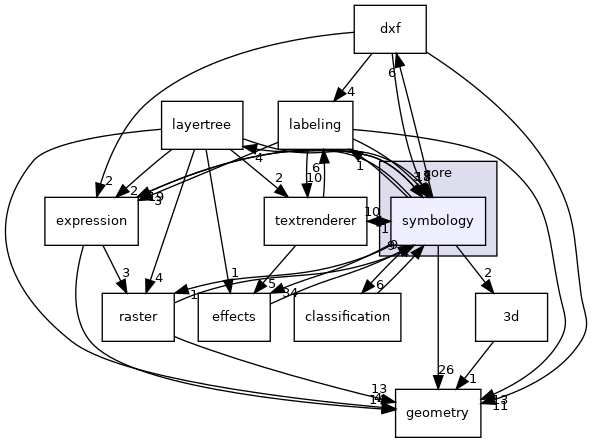
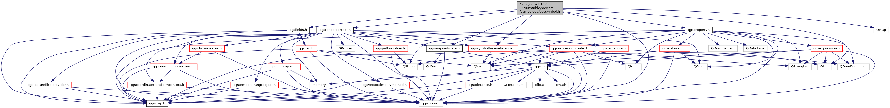
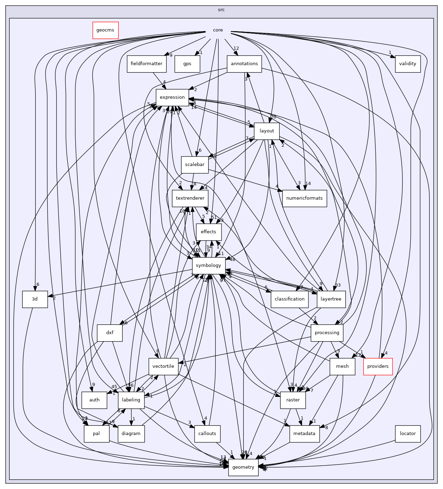

分析QGS文件格式及符号及注记组织结构

<!--more-->

### QGS 文件结构

https://www.osgeo.cn/qgisdoc/docs/user_manual/appendices/qgis_file_formats.html?highlight=qgs#

#### QGS xml结构


#### ProjectLayers 结构

包括图层属性，符号规则，注记规则


#### QLR 图层定义文件


#### QML文件


### MapLayer

StyleCategory


QgsMapLayerStyleManager

管理与一个地图层一起使用的样式。

存储的样式由其名称标识。管理器始终跟踪当前处于活动状态的已存储样式。更改当前样式后，新样式将应用于关联的图层。

QgsMapLayerStyleManagerWidget

#### QgsSymbolLayer

property

| PropertySize                         | 符号大小。                         |
| ------------------------------------ | ---------------------------------- |
| PropertyAngle                        | 符号角度。                         |
| PropertyName                         | 名称，例如简单标记的形状名称。     |
| PropertyFillColor                    | 填色。                             |
| PropertyStrokeColor                  | 描边颜色。                         |
| PropertyStrokeWidth                  | 行程宽度。                         |
| PropertyStrokeStyle                  | 笔触样式（例如，实线，虚线）       |
| PropertyOffset                       | 符号偏移量。                       |
| PropertyCharacter                    | 字符，例如用于字体标记符号层。     |
| PropertyWidth                        | 符号宽度。                         |
| PropertyHeight                       | 符号高度。                         |
| PropertyPreserveAspectRatio          | 保留宽度和高度之间的长宽比。       |
| PropertyFillStyle                    | 填充样式（例如，实心，点）         |
| PropertyJoinStyle                    | 线联接样式。                       |
| PropertySecondaryColor               | 次要颜色（例如用于渐变填充）       |
| PropertyLineAngle                    | 线角或哈希线符号的哈希线角度。     |
| PropertyLineDistance                 | 行之间的距离，或散列线符号的行长。 |
| PropertyGradientType                 | 渐变填充类型。                     |
| PropertyCoordinateMode               | 渐变坐标模式。                     |
| PropertyGradientSpread               | 梯度扩散模式。                     |
| PropertyGradientReference1X          | 渐变参考点1 x。                    |
| PropertyGradientReference1Y          | 梯度参考点1 y。                    |
| PropertyGradientReference2X          | 渐变参考点2 x。                    |
| PropertyGradientReference2Y          | 梯度参考点2 y。                    |
| PropertyGradientReference1IsCentroid | 渐变参考点1是质心。                |
| PropertyGradientReference2IsCentroid | 渐变参考点2为质心。                |
| PropertyBlurRadius                   | Shapeburst模糊半径。               |
| PropertyShapeburstUseWholeShape      | Shapeburst使用整个形状。           |
| PropertyShapeburstMaxDistance        | 边缘距离处的Shapeburst填充。       |
| PropertyShapeburstIgnoreRings        | Shapeburst忽略环。                 |
| PropertyFile                         | 文件名，例如svg文件。              |
| PropertyDistanceX                    | 点之间的水平距离。                 |
| PropertyDistanceY                    | 点之间的垂直距离。                 |
| PropertyDisplacementX                | 水平位移。                         |
| PropertyDisplacementY                | 垂直位移。                         |
| PropertyOpacity                      | 不透明度。                         |
| PropertyCustomDash                   | 自定义破折号模式。                 |
| PropertyCapStyle                     | 线帽样式。                         |
| PropertyPlacement                    | 线标记放置。                       |
| PropertyInterval                     | 行标记间隔。                       |
| PropertyOffsetAlongLine              | 沿线偏移。                         |
| PropertyAverageAngleLength           | 长度到平均符号角度。               |
| PropertyHorizontalAnchor             | 水平锚点。                         |
| PropertyVerticalAnchor               | 垂直锚点。                         |
| PropertyLayerEnabled                 | 是否启用符号层。                   |
| PropertyArrowWidth                   | 箭头尾巴宽度。                     |
| PropertyArrowStartWidth              | 箭头尾部开始宽度。                 |
| PropertyArrowHeadLength              | 箭头长度。                         |
| PropertyArrowHeadThickness           | 箭头的厚度。                       |
| PropertyArrowHeadType                | 箭头类型。                         |
| PropertyArrowType                    | 箭头类型。                         |
| PropertyOffsetX                      | 水平偏移。                         |
| PropertyOffsetY                      | 垂直偏移。                         |
| PropertyPointCount                   | 点数。                             |
| PropertyRandomSeed                   | 随机数种子。                       |
| PropertyClipPoints                   | 标记是否应修剪到多边形边界。       |
| PropertyDensityArea                  | 密度区域。                         |
| PropertyFontFamily                   | 字体系列。                         |
| PropertyFontStyle                    | 字体样式。                         |
| PropertyDashPatternOffset            | 虚线图案偏移量。                   |

#### QgsSymbol





#### 整体功能结构




### symbol xml结构

```xml
<symbol name="高速公路省道" force_rhr="0" type="line" clip_to_extent="1" alpha="1">
    <layer pass="0" enabled="1" locked="0" class="SimpleLine">
        <prop k="align_dash_pattern" v="0"/>
        <prop k="capstyle" v="square"/>
        <prop k="customdash" v="5;2"/>
        <prop k="customdash_map_unit_scale" v="3x:0,0,0,0,0,0"/>
        <prop k="customdash_unit" v="MM"/>
        <prop k="dash_pattern_offset" v="0"/>
        <prop k="dash_pattern_offset_map_unit_scale" v="3x:0,0,0,0,0,0"/>
        <prop k="dash_pattern_offset_unit" v="MM"/>
        <prop k="draw_inside_polygon" v="0"/>
        <prop k="joinstyle" v="bevel"/>
        <prop k="line_color" v="202,72,41,255"/>
        <prop k="line_style" v="solid"/>
        <prop k="line_width" v="1.8"/>
        <prop k="line_width_unit" v="MM"/>
        <prop k="offset" v="0"/>
        <prop k="offset_map_unit_scale" v="3x:0,0,0,0,0,0"/>
        <prop k="offset_unit" v="MM"/>
        <prop k="ring_filter" v="0"/>
        <prop k="tweak_dash_pattern_on_corners" v="0"/>
        <prop k="use_custom_dash" v="0"/>
        <prop k="width_map_unit_scale" v="3x:0,0,0,0,0,0"/>
        <data_defined_properties>
            <Option type="Map">
                <Option name="name" type="QString" value=""/>
                <Option name="properties"/>
                <Option name="type" type="QString" value="collection"/>
            </Option>
        </data_defined_properties>
    </layer>
    <layer pass="0" enabled="1" locked="0" class="SimpleLine">
        <prop k="align_dash_pattern" v="0"/>
        <prop k="capstyle" v="square"/>
        <prop k="customdash" v="5;2"/>
        <prop k="customdash_map_unit_scale" v="3x:0,0,0,0,0,0"/>
        <prop k="customdash_unit" v="MM"/>
        <prop k="dash_pattern_offset" v="0"/>
        <prop k="dash_pattern_offset_map_unit_scale" v="3x:0,0,0,0,0,0"/>
        <prop k="dash_pattern_offset_unit" v="MM"/>
        <prop k="draw_inside_polygon" v="0"/>
        <prop k="joinstyle" v="bevel"/>
        <prop k="line_color" v="255,248,164,255"/>
        <prop k="line_style" v="solid"/>
        <prop k="line_width" v="1.4"/>
        <prop k="line_width_unit" v="MM"/>
        <prop k="offset" v="0"/>
        <prop k="offset_map_unit_scale" v="3x:0,0,0,0,0,0"/>
        <prop k="offset_unit" v="MM"/>
        <prop k="ring_filter" v="0"/>
        <prop k="tweak_dash_pattern_on_corners" v="0"/>
        <prop k="use_custom_dash" v="0"/>
        <prop k="width_map_unit_scale" v="3x:0,0,0,0,0,0"/>
        <data_defined_properties>
            <Option type="Map">
                <Option name="name" type="QString" value=""/>
                <Option name="properties"/>
                <Option name="type" type="QString" value="collection"/>
            </Option>
        </data_defined_properties>
    </layer>
    <layer pass="0" enabled="1" locked="0" class="SimpleLine">
        <prop k="align_dash_pattern" v="0"/>
        <prop k="capstyle" v="square"/>
        <prop k="customdash" v="5;2"/>
        <prop k="customdash_map_unit_scale" v="3x:0,0,0,0,0,0"/>
        <prop k="customdash_unit" v="MM"/>
        <prop k="dash_pattern_offset" v="0"/>
        <prop k="dash_pattern_offset_map_unit_scale" v="3x:0,0,0,0,0,0"/>
        <prop k="dash_pattern_offset_unit" v="MM"/>
        <prop k="draw_inside_polygon" v="0"/>
        <prop k="joinstyle" v="bevel"/>
        <prop k="line_color" v="202,72,41,255"/>
        <prop k="line_style" v="solid"/>
        <prop k="line_width" v="0.2"/>
        <prop k="line_width_unit" v="MM"/>
        <prop k="offset" v="0"/>
        <prop k="offset_map_unit_scale" v="3x:0,0,0,0,0,0"/>
        <prop k="offset_unit" v="MM"/>
        <prop k="ring_filter" v="0"/>
        <prop k="tweak_dash_pattern_on_corners" v="0"/>
        <prop k="use_custom_dash" v="0"/>
        <prop k="width_map_unit_scale" v="3x:0,0,0,0,0,0"/>
        <data_defined_properties>
            <Option type="Map">
                <Option name="name" type="QString" value=""/>
                <Option name="properties"/>
                <Option name="type" type="QString" value="collection"/>
            </Option>
        </data_defined_properties>
    </layer>
</symbol>

<symbol name="乡界" force_rhr="0" type="line" clip_to_extent="1" alpha="1">
    <layer pass="0" enabled="1" locked="0" class="SimpleLine">
        <prop k="align_dash_pattern" v="0"/>
        <prop k="capstyle" v="square"/>
        <prop k="customdash" v="5;2"/>
        <prop k="customdash_map_unit_scale" v="3x:0,0,0,0,0,0"/>
        <prop k="customdash_unit" v="MM"/>
        <prop k="dash_pattern_offset" v="0"/>
        <prop k="dash_pattern_offset_map_unit_scale" v="3x:0,0,0,0,0,0"/>
        <prop k="dash_pattern_offset_unit" v="MM"/>
        <prop k="draw_inside_polygon" v="0"/>
        <prop k="joinstyle" v="bevel"/>
        <prop k="line_color" v="241,156,173,255"/>
        <prop k="line_style" v="solid"/>
        <prop k="line_width" v="2"/>
        <prop k="line_width_unit" v="MM"/>
        <prop k="offset" v="0"/>
        <prop k="offset_map_unit_scale" v="3x:0,0,0,0,0,0"/>
        <prop k="offset_unit" v="MM"/>
        <prop k="ring_filter" v="0"/>
        <prop k="tweak_dash_pattern_on_corners" v="0"/>
        <prop k="use_custom_dash" v="0"/>
        <prop k="width_map_unit_scale" v="3x:0,0,0,0,0,0"/>
        <data_defined_properties>
            <Option type="Map">
                <Option name="name" type="QString" value=""/>
                <Option name="properties"/>
                <Option name="type" type="QString" value="collection"/>
            </Option>
        </data_defined_properties>
    </layer>
    <layer pass="0" enabled="1" locked="0" class="SimpleLine">
        <prop k="align_dash_pattern" v="0"/>
        <prop k="capstyle" v="square"/>
        <prop k="customdash" v="0.7;1.4"/>
        <prop k="customdash_map_unit_scale" v="3x:0,0,0,0,0,0"/>
        <prop k="customdash_unit" v="MM"/>
        <prop k="dash_pattern_offset" v="0"/>
        <prop k="dash_pattern_offset_map_unit_scale" v="3x:0,0,0,0,0,0"/>
        <prop k="dash_pattern_offset_unit" v="MM"/>
        <prop k="draw_inside_polygon" v="0"/>
        <prop k="joinstyle" v="bevel"/>
        <prop k="line_color" v="35,35,35,255"/>
        <prop k="line_style" v="dot"/>
        <prop k="line_width" v="0.3"/>
        <prop k="line_width_unit" v="MM"/>
        <prop k="offset" v="0"/>
        <prop k="offset_map_unit_scale" v="3x:0,0,0,0,0,0"/>
        <prop k="offset_unit" v="MM"/>
        <prop k="ring_filter" v="0"/>
        <prop k="tweak_dash_pattern_on_corners" v="0"/>
        <prop k="use_custom_dash" v="0"/>
        <prop k="width_map_unit_scale" v="3x:0,0,0,0,0,0"/>
        <data_defined_properties>
            <Option type="Map">
                <Option name="name" type="QString" value=""/>
                <Option name="properties"/>
                <Option name="type" type="QString" value="collection"/>
            </Option>
        </data_defined_properties>
    </layer>
</symbol>

    <symbol name="行政村" force_rhr="0" type="marker" clip_to_extent="1" alpha="1">
        <layer pass="0" enabled="1" locked="0" class="SimpleMarker">
            <prop k="angle" v="0"/>
            <prop k="color" v="255,255,255,255"/>
            <prop k="horizontal_anchor_point" v="1"/>
            <prop k="joinstyle" v="bevel"/>
            <prop k="name" v="circle"/>
            <prop k="offset" v="0,0"/>
            <prop k="offset_map_unit_scale" v="3x:0,0,0,0,0,0"/>
            <prop k="offset_unit" v="MM"/>
            <prop k="outline_color" v="35,35,35,255"/>
            <prop k="outline_style" v="solid"/>
            <prop k="outline_width" v="0.4"/>
            <prop k="outline_width_map_unit_scale" v="3x:0,0,0,0,0,0"/>
            <prop k="outline_width_unit" v="MM"/>
            <prop k="scale_method" v="diameter"/>
            <prop k="size" v="2"/>
            <prop k="size_map_unit_scale" v="3x:0,0,0,0,0,0"/>
            <prop k="size_unit" v="MM"/>
            <prop k="vertical_anchor_point" v="1"/>
            <data_defined_properties>
                <Option type="Map">
                    <Option name="name" type="QString" value=""/>
                    <Option name="properties"/>
                    <Option name="type" type="QString" value="collection"/>
                </Option>
            </data_defined_properties>
        </layer>
    </symbol>
    <symbol name="绿地" force_rhr="0" type="fill" clip_to_extent="1" alpha="1">
        <layer pass="0" enabled="1" locked="0" class="SimpleFill">
            <prop k="border_width_map_unit_scale" v="3x:0,0,0,0,0,0"/>
            <prop k="color" v="133,182,111,255"/>
            <prop k="joinstyle" v="bevel"/>
            <prop k="offset" v="0,0"/>
            <prop k="offset_map_unit_scale" v="3x:0,0,0,0,0,0"/>
            <prop k="offset_unit" v="MM"/>
            <prop k="outline_color" v="35,35,35,255"/>
            <prop k="outline_style" v="solid"/>
            <prop k="outline_width" v="0.26"/>
            <prop k="outline_width_unit" v="MM"/>
            <prop k="style" v="solid"/>
            <data_defined_properties>
                <Option type="Map">
                    <Option name="name" type="QString" value=""/>
                    <Option name="properties"/>
                    <Option name="type" type="QString" value="collection"/>
                </Option>
            </data_defined_properties>
        </layer>
    </symbol>

```
