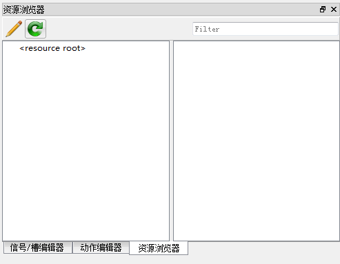
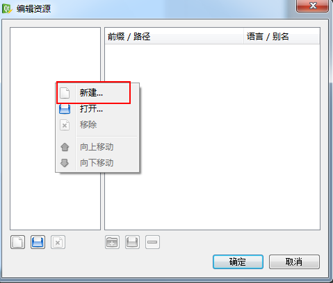
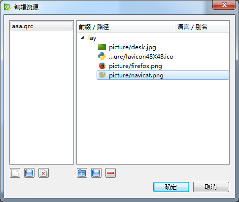
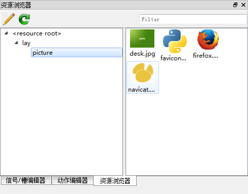

<!--more-->

### Qt Designer 加入资源文件

Qt Designer中如果在设计UI界面的时候要加入一些图素，图标等资源的时候是不能直接添加进去的，需要在Qt开发目录下编写QRC文件

qrc文件格式如下：

```qrc
<RCC>
  <qresource prefix="/images">
    <file>mActionPan.png</file>
    <file>Themes/mActionPanSelected.svg</file>
  </qresource>
</RCC>
```

**第一步：**

选择  “资源浏览器”



点击类似铅笔的button

**第二步：**

从编辑资源选择击鼠标右键，



新建一个image.qrc文件，

**第三步：**

添加资源，先选择一个新前缀，然后添加文件



 



确定之后就可以在需要资源的地方引用资源浏览器的图片或文件了！

### QGIS工程添加qrc文件

在创建的QT工程中，引入qgis，在使用qgis的图标时，在QtDesigner中能够看到图标，运行后，看不到，需要在Resource Files 下添加 images 文件夹下的image.qrc