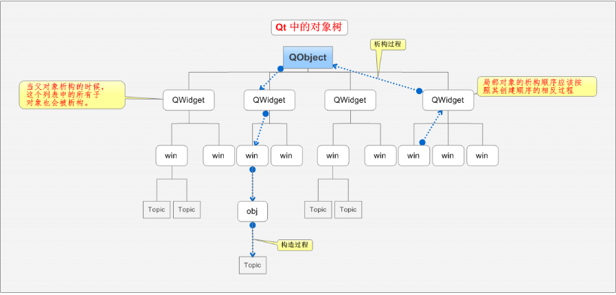
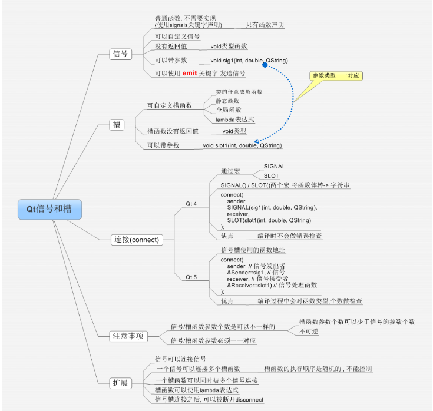

QT的信号和槽的详解，包括简介，信号和槽分析以及一个实例
<!--more-->
# 1 简介
 信号和槽是Qt特有的信息传输机制，是Qt设计程序的重要基础，它可以让互不干扰的对象建立一种联系。
<!--more-->
  在GUI编程中，当我们改变一个部件时，经常想要其他部件被通知。更一般化，我们希望任何一类的对象可以和其它对象进行通讯。例如，如果我们点击一个关闭按钮，我们可能想要窗口的close()函数被调用。

  其他工具包通过回调实现了这种通信。回调是一个函数指针，所以如果你希望一个处理函数通知你一些事件，你可以把另一个函数（回调）的指针传递给处理函数。处理函数在适当的时候调用回调。尽管一些成功的框架使用了这个方法，但是回调可能是不直观的，并可能在确保回调参数类型正确性上存在问题。  
信号槽是 Qt 框架引以为豪的机制之一。所谓信号槽，实际就是观察者模式。当某个事件发生之后，比如，按钮检测到自己被点击了一下，它就会发出一个信号（signal）。这种发出是没有目的的，类似广播。如果有对象对这个信号感兴趣，它就会使用连接（connect）函数，意思是，将想要处理的信号和自己的一个函数（称为槽（slot））绑定来处理这个信号。也就是说，当信号发出时，被连接的槽函数会自动被回调。这就类似观察者模式：当发生了感兴趣的事件，某一个操作就会被自动触发。（这里提一句，Qt 的信号槽使用了额外的处理来实现，并不是 GoF 经典的观察者模式的实现方式。）

  信号和槽是Qt特有的信息传输机制，是Qt设计程序的重要基础，它可以让互不干扰的对象建立一种联系。

  槽的本质是类的成员函数，其参数可以是任意类型的。和普通C++成员函数几乎没有区别，它可以是虚函数；也可以被重载；可以是公有的、保护的、私有的、也可以被其他C++成员函数调用。唯一区别的是：槽可以与信号连接在一起，每当和槽连接的信号被发射的时候，就会调用这个槽。
  Qt的小部件有很多预定义的信号，但是我们总是可以通过继承来加入我们自己的信号。槽就是一个对应于特定信号的被调用的函数。Qt的部件有很多预定义的槽，但同样可以通过子类化加入自己的槽来处理感兴趣的信号。
## 1.1 对象树(子对象动态分配空间不需要释放)
  
   比如说当应用程序创建了一个具有父窗口部件的对象时，该对象将被加入父窗口部件的孩子列表。当应用程序销毁父窗口部件时，其下的孩子列表中的对象将被一一删除。这让我们在编程时，能够将主要精力放在系统的业务上，提高编程效率，同时也保证了系统的稳健性。
# 2 信号和槽
  在Qt中我们有一种可以替代回调的技术：我们使用信号和槽。当一个特定事件发生的时候，一个信号被发射。Qt的小部件有很多预定义的信号，但是我们总是可以通过继承来加入我们自己的信号。槽就是一个对应于特定信号的被调用的函数。Qt的部件有很多预定义的槽，但同样可以通过子类化加入自己的槽来处理感兴趣的信号。
  信号和槽机制是类型安全的：一个信号的签名(参数类型)必须与它的接收槽的签名相匹配。（实际上，一个槽的签名可能比它接收到的信号短，因为它可以忽略额外的参数。）因为签名是兼容的，当使用基于函数指针的语法时，编译器就可以帮助我们检测类型不匹配。基于字符串的信号和槽语法将在运行时检测类型不匹配。信号和插槽是松散耦合的：一个发射信号的类不用知道也不用关心哪个槽要接收这个信号。Qt的信号和槽的机制可以保证如果你把一个信号和一个槽连接起来，槽会在正确的时间使用信号的参数被调用。信号和槽可以使用任何数量、任何类型的参数。它们是完全类型安全的：不会再有回调核心转储(core dump)。

  从QObject类或者它的子类（如QWidget类）继承的所有类可以包含信号和槽。当改变它们的状态的时候，信号被发送。从某种意义上说，即它们对其他对象感兴趣。这就是所有的对象通讯时所做的一切。它不知道也不关心是否有其他对象接收到了它发射的信号。这就是真正的信息封装，并且确保对象可以用作一个软件组件使用。
  
  槽可以用来接收信号，但它们也是普通的成员函数。正如一个对象不知道有其他对象收到它的信号一样，一个槽也不知道它是否被任意信号连接。因此，这种方式保证了Qt创建组件的完全独立。
  
  你可以连接多个信号到一个槽，同样一个信号可以被你需要的多个槽连接。甚至可以一个信号连接到另一个信号。（该情况下，只要第一个信 号被发射时，第二个信号立即被发射。）
  
  总体来看，信号和槽构成了一个强有力的组件编程机制。
## 2.1 信号
  当一个对象内部状态发生改变时发射信号，信号就被发射，在某些方面对象的客户端和所有者可能感兴趣。信号是一个public访问函数并可以在任何地方发射，但是我们建议仅在定义了信号的类及他们的子类中发射。
  
  当一个信号被发射，它所连接的槽会被立即执行，类似于一个普通函数的调用。在该情况下，信号/槽机制在任何GUI事件循环中是完全独立的。一旦所有的槽返回了，emit语句随后的代码将会执行。这与queued connections方式有些许不同，queued connections方式下emit关键字随后的代码会立即继续执行，槽在随后执行（相当于异步，参考信号与槽的连接类型）。
  
  如果几个槽被连接到一个信号，当信号被发射时，这些槽就会按它们连接的顺序挨个执行。
  
  信号会由moc自动生成并一定不要在.cpp文件中实现。它们也不能有任何返回类型（也就是 只能使用void）。
  
## 2.2 槽
  当与槽连接的信号被发射时，该槽被调用。槽是普通的C++函数可以正常调用；它们唯一的特点就是可以被信号连接。
  
  因为槽是普通成员函数，所以被直接调用时遵循一般的C++规则。然而，作为槽，它们能被任何组件调用，通过信号槽连接，无需考虑访问级别。这意味着从一个任意类的实例发出的一个信号可以在一个不相关的类的实例中调用一个私有槽。
  
  同样还可以定义虚拟槽，我们在实践中发现它非常有用。
  
  与回调相比，信号和插槽的速度稍慢，因为它们增加了灵活性，尽管在实际应用程序中的差异是微不足道的。
  
  信号和槽的机制是非常有效的，但是它不像“真正的”回调那样快。信号和槽稍微有些慢，这是因为它们所提供的灵活性造成，尽管在实际应用中这些性能可以被忽略。通常，发射一个和槽相连的信号，大约比直接调接收器非虚函数的调用慢十倍。这是定位连接对象所需的开销，为了安全地遍历所有连接（e.g检查随后的接收器在发射过程中没有被销毁），并以通用的方式安排任意参数。虽然10个非虚函数调用听起来可能很多，但开销比任意new或delete 操作少得多。当执行一个字符串时，vector或list操作在后面的场景中需要new或delete, 但信号和槽在完成函数调用的开销中只占很小的一部分。在一个槽中进行系统调用或者间接地调用超过10个函数，情况也是相同的;。信号/插槽机制的简单和灵活性对于时间的开销是值得，用户甚至不会注意到这点。
  
  注意，与基于qt的应用程序一起编译时，定义变量的其他库调用信号和槽可能会造成编译器警告和错误。要解决这个问题，#undef这些预处理器的冲突符号即可。
## 2.3 一个Qt Creator的例子
 
  ```
   #include <QApplication>
   #include <QPushButton>
      int main(int argc, char *argv[])
      {
          QApplication app(argc, argv);
          QPushButton button("Quit");
          QObject::connect(&button, &QPushButton::clicked,
          &app, &QApplication::quit);
          button.show();
          return app.exec();
      }
  ```
  在 Qt Creator 中创建工程的方法创建好工程，然后将main()函数修改为上面的代码。点击运行，我们会看到一个按钮，上面有“Quit”字样。点击按钮，程序退出。  
  connect()函数最常用的一般形式：
  __connect(sender, signal, receiver, slot);__  
  参数：
   sender：发出信号的对象    
   signal：发送对象发出的信号    
   receiver：接收信号的对象    
   slot：接收对象在接收到信号之后所需要调用的函数    
  信号槽要求信号和槽的参数一致，所谓一致，是参数类型一致。如果不一致，允许的情况是，槽函数的参数可以比信号的少，即便如此，槽函数存在的那些参数的顺序也必须和信号的前面几个一致起来。这是因为，你可以在槽函数中选择忽略信号传来的数据（也就是槽函数的参数比信号的少），但是不能说信号根本没有这个数据，你就要在槽函数中使用（就是槽函数的参数比信号的多，这是不允许的）。
## 2.4 一个普通C++程序的例子
  一个小的C++类声明如下：
  ```
   class Counter
    {
        public:
            Counter() { m_value = 0; }
      
            int value() const { return m_value; }
            void setValue(int value);
        private:
            int m_value;
    };
  ```
  一个小的基于QObject类如下：
   ```
   #include <QObject>
   
     class Counter : public QObject
     {
         Q_OBJECT   
         public:
             Counter() { m_value = 0; }       
             int value() const { return m_value; }       
         public slots:
             void setValue(int value);       
         signals:
             void valueChanged(int newValue);      
         private:
             int m_value;
     };
   ```
   这个基于QObject的类有同样的内部状态，并提供公有方法来访问状态。除此之外，这个类可以通过发射一个valueChanged()信号来告诉外部世界关于它的状态改变，并且它有一个槽，其它对象可以发送信号给这个槽。  
   所有包含信号和/或者槽的类必须在它们的声明中提到Q_OBJECT。它们也必须从QObject继承(直接或间接)。   
   槽由应用程序的编写者来实现。这里是Counter::setValue()可能的一个槽实现：
   ```
   void Counter::setValue(int value)
     {
         if (value != m_value) {
             m_value = value;
             emit valueChanged(value);
         }
     }
   ```
   emit这一行从对象中发射valueChanged()信号，以一个新值作为参数。
   在下面的小片断中，我们创建了两个Counter对象，并使用QObject::connect()将第一个对象的valueChanget()信号连接到第二个对象的setValue槽。
   下面是把两个对象连接在一起的一种方法：
   ```
     Counter a, b;
         QObject::connect(&a, &Counter::valueChanged,
                          &b, &Counter::setValue);
   
         a.setValue(12);     // a.value() == 12, b.value() == 12
         b.setValue(48);     // a.value() == 12, b.value() == 48    
   ```
  调用a.setValue(12)会使a发射一个valueChanged(12) 信号，b将会在它的setValue()槽中接收这个信号，也就是b.setValue(12) 被调用。接下来b会发射同样的valueChanged()信号，但是因为没有槽被连接到b的valueChanged()信号，所以该信号被忽略。
  
  注意只有当value!= m_value的时候setValue()函数才会设置这个值并发射信号。这样就避免了存在环connections的情况下无限循环。（比如b.valueChanged() 和a.setValue()连接在一起）。
  
  默认情况下，对于你做出的每一个连接，一个信号被发射;重复连接下两个信号被发射。你可以调用disconnect()中断所有连接。如果传递了Qt::UniqueConnection类型，连接只有在不重复的情况下才建立。如果已经存在重复连接（同一个对象上确定的信号到确定的槽），则连接将会失败，connect返回fase。
  
  这个例子说明了对象可以协同工作而不需要知道彼此的任何信息。为达到这种效果，对像仅需要相互连接，并用一个简单的QObject::connect()函数调用实现，或者使用uic的自动连接特性。
 ## 2.5 带有默认参数的信号和槽
   信号和槽的签名可能包含参数，参数可以有默认值。考虑QObject::destroyed()函数。  
   `void destroyed(QObject* = 0);`  
   当一个QObject对象被删除，它发射QObject::destroyed()信号。我们想捕获此信号，无论在我们可能有一个悬空的引用指向删除的QObject对象的情况下，因此我们可以把它清理干净。一个合适的槽签名可能是这样的:  
    `void objectDestroyed(QObject* obj = 0);`   
   为连接一个信号到此槽，我们使用QObject::connect。这里有几个方式连接。第一种方式是使用函数指针：  
    `connect(sender,&QObject::destroyed,this,&MyObject::objectDestroyed);`    
   连接信号到槽的另一种方法是使用QObject::connect()，SIGNAL和SLOT宏。关于是否在SIGNAL()和SLOT()宏中包含参数的规则，如果参数有默认值，传递给SIGNAL()宏的签名必须不能少于传递给SLOT()宏签名的参数。
   下述这些都会生效：  
```
    connect(sender,SIGNAL(destroyed(QObject*)),this,
    SLOT(objectDestroyed(Qbject*)));
    
    connect(sender,SIGNAL(destroyed(QObject*)),this,
    SLOT(objectDestroyed()));
    
    connect(sender, SIGNAL(destroyed()),this,
    SLOT(objectDestroyed()));  
 ```
## 2.6 信号和槽的进一步使用
   对于可能需要信号发送者信息的情况, Qt提供了QObject::sender()函数，它返回一个指向发送信号的对象的指针。
   
   QSignalMapper类为一种情形提供，该情况下多个信号连接到同一个槽，而槽需要以不同的方式处理每个信号。
   
   假设有三个按钮来决定将打开哪个文件: “Tax File”, “Accounts File”, “Report File”.
   
   为了打开正确的文件,使用QSignalMapper:setMapping()来映射所有QPushButton:clicked()到QSignalMapper对象。然后将文件的QPushButton::clicked()信号连接到QSignalMapper::map()槽。  
   ```
      signalMapper = new QSignalMapper(this);
             
             signalMapper->setMapping(taxFileButton,   QString("taxfile.txt"));
             
             signalMapper->setMapping(accountFileButton,
                                     QString("accountsfile.txt"));
             
             signalMapper->setMapping(reportFileButton,
                                     QString("reportfile.txt"));
             
             connect(taxFileButton, &QPushButton::clicked,
                       signalMapper, &QSignalMapper::map);
             
             connect(accountFileButton, &QPushButton::clicked,
                       signalMapper, &QSignalMapper::map);
             
             connect(reportFileButton, &QPushButton::clicked,
                       signalMapper, &QSignalMapper::map); 
   ```
   然后，将mapped()信号连接到readFile()，根据按下的按钮，readFile()打开不同的文件。`connect(signalMapper, SIGNAL(mapped(QString)),this, SLOT(readFile(QString)));`  
## 2.7 自定义信号槽
* 发送者和接收者都需要是QObject的子类（当然，槽函数是全局函数、Lambda 表达式等无需接收者的时候除外）； 
* 使用 signals 标记信号函数，信号是一个函数声明，返回 void，不需要实现函数代码；
* 槽函数是普通的成员函数，作为成员函数，会受到 public、private、protected 的影响；
* 使用 emit 在恰当的位置发送信号；
* 使用QObject::connect()函数连接信号和槽。
* 任何成员函数、static 函数、全局函数和 Lambda 表达式都可以作为槽函数 
## 2.8 信号槽的更多用法
* 一个信号可以和多个槽相连  
　　如果是这种情况，这些槽会一个接一个的被调用，但是它们的调用顺序是不确定的。
* 多个信号可以连接到一个槽  
　　只要任意一个信号发出，这个槽就会被调用。
* 一个信号可以连接到另外的一个信号  
　　当第一个信号发出时，第二个信号被发出。除此之外，这种信号-信号的形式和信号-槽的形式没有什么区别。
* 槽可以被取消链接  
　　这种情况并不经常出现，因为当一个对象delete之后，Qt自动取消所有连接到这个对象上面的槽。
* 使用Lambda 表达式  
　　在使用 Qt 5 的时候，能够支持 Qt 5 的编译器都是支持 Lambda 表达式的。
　　我们的代码可以写成下面这样：
    ```
    QObject::connect(&newspaper, static_cast<void (Newspaper:: *)
    (const QString &)>(&Newspaper::newPaper),
    [=](const QString &name) 
    { /* Your code here. */ }
    );
    ```
在连接信号和槽的时候，槽函数可以使用Lambda表达式的方式进行处理。
# 3 案例
mainwidget.h
    ```
    #ifndef MAINWIDGET_H
    #define MAINWIDGET_H
    
    #include <QWidget>
    #include <QPushButton>
    #include "subwidget.h" //子窗口头文件
    
    class MainWidget : public QWidget
    {
        Q_OBJECT
    
    public:
        MainWidget(QWidget *parent = 0);
        ~MainWidget();
    
    public slots:
        void mySlot();
        void changeWin();
        void dealSub();
        void dealSlot(int, QString);
    
    private:
        QPushButton b1;
        QPushButton *b2;
        QPushButton b3;
    
        SubWidget subWin;
    };
    
    #endif // MAINWIDGET_H
    ```
subwidget.h
    ```
    #ifndef SUBWIDGET_H
    #define SUBWIDGET_H
    
    #include <QWidget>
    #include <QPushButton>
    
    class SubWidget : public QWidget
    {
        Q_OBJECT
    public:
        explicit SubWidget(QWidget *parent = 0);
    
        void sendSlot();
    
    signals:
         /* 信号必须有signals关键字来声明
          * 信号没有返回值，但可以有参数
          * 信号就是函数的声明，只需声明，无需定义
          * 使用：emit mySignal();
          * 信号可以重载
         */
    
        void mySignal();
        void mySignal(int, QString);
    
    public slots:
    
    private:
        QPushButton b;
    };
    
    #endif // SUBWIDGET_H
    ```
main.cpp
    ```
    #include "mainwidget.h"
    #include <QApplication>
    
    int main(int argc, char *argv[])
    {
        QApplication a(argc, argv);
        MainWidget w;//执行MainWidget的构造函数
        w.show();
    
        return a.exec();
    }
    ```
mainvidget.cpp
    ```
    #include "mainwidget.h"
    #include <QPushButton>
    #include <QDebug> //打印
    
    MainWidget::MainWidget(QWidget *parent)
        : QWidget(parent)
    {
        b1.setParent(this);
        b1.setText("close");
        b1.move(100, 100);
    
        b2 = new QPushButton(this);
        b2->setText("abc");
    
        connect(&b1, &QPushButton::pressed, this, &MainWidget::close);
        /* &b1: 信号发出者，指针类型
         * &QPushButton::pressed：处理的信号，  &发送者的类名::信号名字
         * this: 信号接收者
         * &MainWidget::close： 槽函数，信号处理函数  &接收的类名::槽函数名字
         * 发送-处理-接收-处理
        */
    
        /* 自定义槽，普通函数的用法
         * Qt5：任意的成员函数，普通全局函数，静态函数
         * 槽函数需要和信号一致（参数，返回值）
         * 由于信号都是没有返回值，所以，槽函数一定没有返回值
         */
        connect(b2, &QPushButton::released, this, &MainWidget::mySlot);
    
        connect(b2, &QPushButton::released, &b1, &QPushButton::hide);
    
        /* 信号：短信
         * 槽函数：接收短信的手机
         */
    
        setWindowTitle("老大");
        //this->setWindowTitle("老大");//等价同上
    
        b3.setParent(this);
        b3.setText("切换到子窗口");
        b3.move(50, 50);
    
        //显示子窗口
        //subWin.show();
    
        connect(&b3, &QPushButton::released, this, &MainWidget::changeWin);
    
    
        //处理子窗口的信号
    //    void (SubWidget::*funSignal)() = &SubWidget::mySignal;
    //    connect(&subWin, funSignal, this, &MainWidget::dealSub);
    
    //     void (SubWidget::*testSignal)(int, QString) = &SubWidget::mySignal;
    //    connect(&subWin, testSignal, this, &MainWidget::dealSlot);
    
        //Qt4信号连接
        //Qt4槽函数必须有slots关键字来修饰
        connect(&subWin, SIGNAL(mySignal()), this, SLOT(dealSub()) );
    
        connect(&subWin, SIGNAL(mySignal(int,QString)),
                this, SLOT(dealSlot(int,QString)) );
        //缺点： SIGNAL SLOT 将函数名字 -> 字符串  不进行错误检查
    
        //Lambda表达式, 匿名函数对象
        //C++11增加的新特性， 项目文件： CONFIG += C++11
        //Qt配合信号一起使用，非常方便
    
        QPushButton *b4 = new QPushButton(this);
        b4->setText("Lambda表达式");
        b4->move(150, 150);
        int a = 10, b = 100;
        connect(b4, &QPushButton::clicked,
                // = :把外部所有局部变量、类中所有成员以值传递方式
                // this: 类中所有成员以值传递方式
                // & : 把外部所有局部变量， 引用符号
                [=](bool isCheck)
                {
                    qDebug() << isCheck;
                }
    
    
                );
    
    
        resize(400, 300);
    }
    
    void MainWidget::dealSlot(int a, QString str)
    {
        // str.toUtf8() -> 字节数组QByteArray
        // ……data()  -> QByteArray -> char *
        qDebug() << a << str.toUtf8().data();
    }
    
    void MainWidget::mySlot()
    {
        b2->setText("123");
    }
    
    void MainWidget::changeWin()
    {
        //子窗口显示
        subWin.show();
        //本窗口隐藏
        this->hide();
    }
    
    
    void MainWidget::dealSub()
    {
        //子窗口隐藏
        subWin.hide();
        //本窗口显示
        show();
    }
    
    MainWidget::~MainWidget()
    {
    
    }
    ```
subwidget.cpp
    ```
    #include "subwidget.h"
    
    SubWidget::SubWidget(QWidget *parent) : QWidget(parent)
    {
        this->setWindowTitle("小弟");
        b.setParent(this);
        b.setText("切换到主窗口");
    
        connect(&b, &QPushButton::clicked, this, &SubWidget::sendSlot);
    
        resize(400, 300);
    }
    
    void SubWidget::sendSlot()
    {
        emit mySignal();
        emit mySignal(250, "我是子窗口");
    }
    ```
SingnalAndSlot.pro
    ```
    QT       += core gui
    
    greaterThan(QT_MAJOR_VERSION, 4): QT += widgets
    
    TARGET = 03_SignalAndSlot
    TEMPLATE = app
    
    
    SOURCES += main.cpp\
            mainwidget.cpp \
        subwidget.cpp
    
    HEADERS  += mainwidget.h \
        subwidget.h
    
    CONFIG += C++11
    ```
# 4 总结


# 5 参考博文
1. C++_之Qt的信号和槽的详解 https://www.cnblogs.com/wanghui1234/p/8964968.html  
2. Qt信号和槽机制 https://blog.csdn.net/lsfreeing/article/details/78575246
