<!--more-->

## SVG优势

随着高清屏幕的普及，相比使用png等位图而言，使用SVG等矢量图形是一种全新的设计方式。更重要的是相比位图而言，SVG有着无可比拟的优势。这里我总结一下SVG具体的一些优势：

1. SVG是矢量图形文件，可以随意改变大小，而不影响图标质量。
2. 可以用CSS样式来自由定义图标颜色，比如颜色/尺寸等效果。
3. 所有的SVG可以全部在一个文件中，节省HTTP请求 。
4. 使用SMIL、CSS或者是javascript可以制作充满灵性的交互动画效果。
5. 由于SVG也是一种XML节点的文件，所以可以使用gzip的方式把文件压缩到很小。

## 使用方法

在web开发中，SVG主要有下面几种使用方法：

1. 使用img和object标签直接引用svg。这种方法的缺点主要在于要求每个图标都单独保存成一个SVG文件，使用时也是单独请求的，增加了HTTP请求。
2. Inline SVG，直接把SVG写入 HTML 中，这种方法简单直接，而且具有非常好的可调性。Inline SVG 作为HTML文档的一部分，不需要单独请求。临时需要修改某个图标的形状也比较方便。但是Inline SVG使用上比较繁琐，需要在页面中插入一大块SVG代码不适合手写，图标复用起来也比较麻烦。
3. SVG Sprite。这里所说的Sprite技术，没错，类似于CSS中的Sprite技术。图标图形整合在一起，实际呈现的时候准确显示特定图标。其实基础的SVG Sprite也只是将原来的位图改成了SVG而已。
4.  最后就是本文的主角啦。使用svg中的<symbol>元素来制作icon。

现在，我们着重介绍的是使用svg中的<symbol>元素来制作icon，在上面说到的SVG Sprite中，我们需要使用相对位置来控制哪个图标被显示出来，但是SVG本身的定义是允许你可以使用<use>的方式直接引用SVG中的某一部分。

那么<symbol>元素是什么呢？按字面意思的话是符号的意思，如果把一个SVG文件比喻成一个书柜的话，那么<symbol>则就表示书柜中一本本不同类别的书籍。这些一本本不同类别的书本就是我们要使用的<symbol>图标。

下面的代码就是将多个SVG图标整合成一个SVG文件之后的样子，可以看到代码中有不同类别的<symbol>元素，它们就是我们要引用的图标：

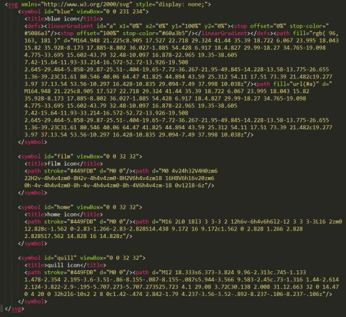
每个Symbol设置一个id作为引用时的名字。使用id引用这个SVG中的Icon有两种方法。

第一种，将上述SVG作为body的第一个元素插入在HTML中， 此后，在需要显示某个 Icon 的地方插入下面的代码即可：

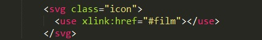

第二种是，是使用完整路径引用Icon。 也就是：

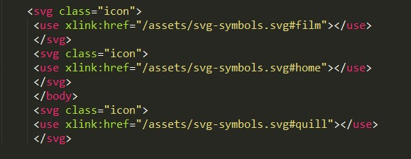

这种方法不需要像Sprite那样繁琐的设置图片的位移。使用id命名图标并使用时直接使用id引用既直观又简单。

## 自动化合并工具

问题来啦，如果碰到很多的图标，难道我们都要手动去合并为一个SVG吗？当然不用。

这里介绍一个专门用于处理SVG Symbols用的glup插件[gulp-svg-symbols](https://github.com/Hiswe/gulp-svg-symbols)。

下面我们就来以一个实例一步一步来使用下这个插件。

首先新建一个文件夹，目录结构如下图所示：

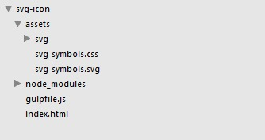

svg文件夹是用来存放svg格式文件的。

当然首先是你得有glup环境，至于glup环境的安装这里就不再阐述了，详细的安装使用教程可以去[这篇文章](http://blog.segmentfault.com/laopopo/1190000000372547)看看。

然后在你的项目目录下运行下面的命令安装插件：

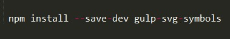

最后在你的项目目录新建一个**gulpfile.js**文件，写入下面的代码：

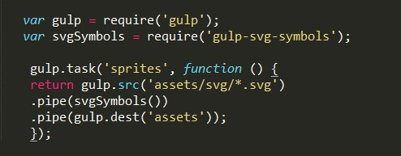

ok。基本的环境搭好啦，正所谓，巧妇难为无米之炊。上哪找svg图标去呢？ 这里推荐去[icomoon.io](https://icomoon.io/app/#/select) 这个专门提供矢量图标网站下载矢量图像，重要的是它提供SVG格式的图形下载。

我们这里就以icomoon.io为例，首先是点击你需要下载的图形，选中它，然后点击下载按钮：

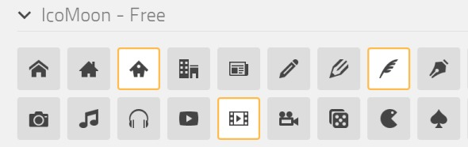

点击下载svg：

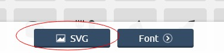

然后按照我们上面的配置文件，我们把下载好的svg图标放到svg文件夹中。

一切准备就绪，在你的项目目录中，运行gulp sprites命令：

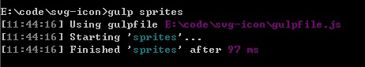

运行命令之后，它会在你的目录中生成一个svg文件，用你常用的代码编辑器打开svg文件，可以看到svg图标都被合并到一个文件中。并且根据对应SVG文件的名称生成了ID，如下图所示：

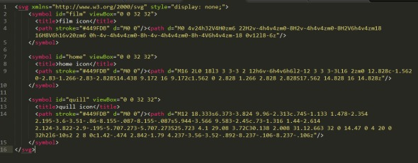

那怎么使用呢它们呢？直接在html文件中使用，并且可以直接使用css来定义宽高、填充颜色等属性。如下代码所示：

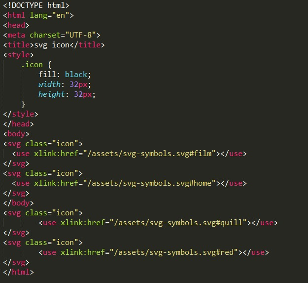

不过由于浏览器安全策略限制的原因，我们不能在本地直接打开html文件来预览我们引用的svg文件，需要以服务器的形式来打开，用gulp也很容易搞定一个简单的服务器环境。首先我们需要安装gulp-connect这个模块，运行下面的命令：

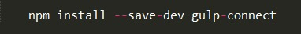

然后修改下gulpfile.js文件中的配置项：

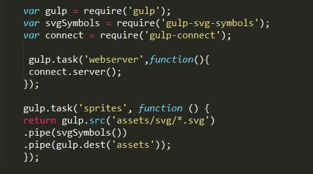

运行gulp webserver命令，打开localhost:8080，就可以看到我们引入的svg图标了：

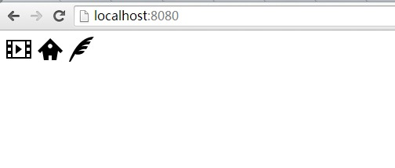

转自:https://www.cnblogs.com/wusl123/p/14278359.html