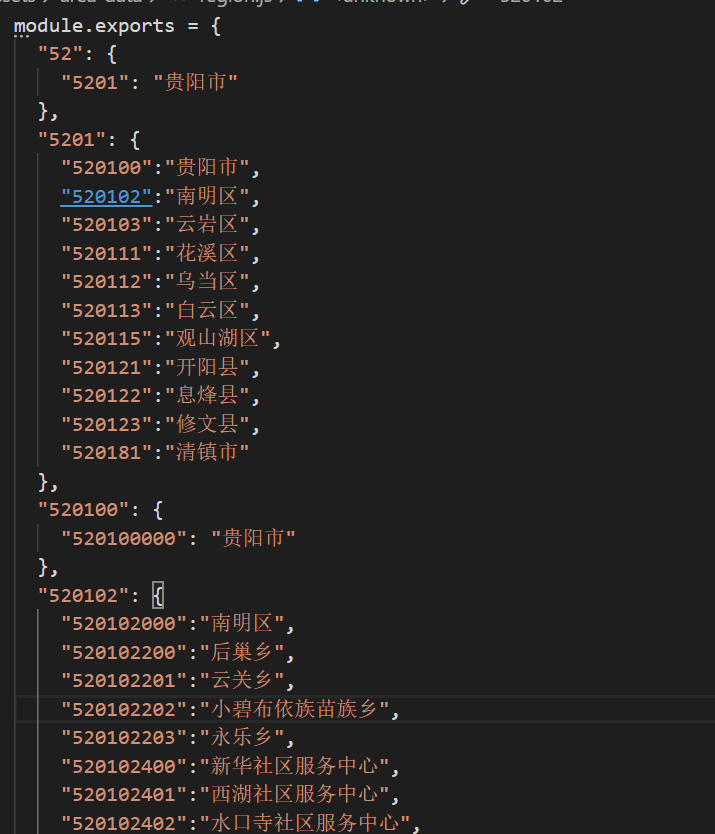
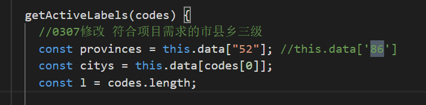
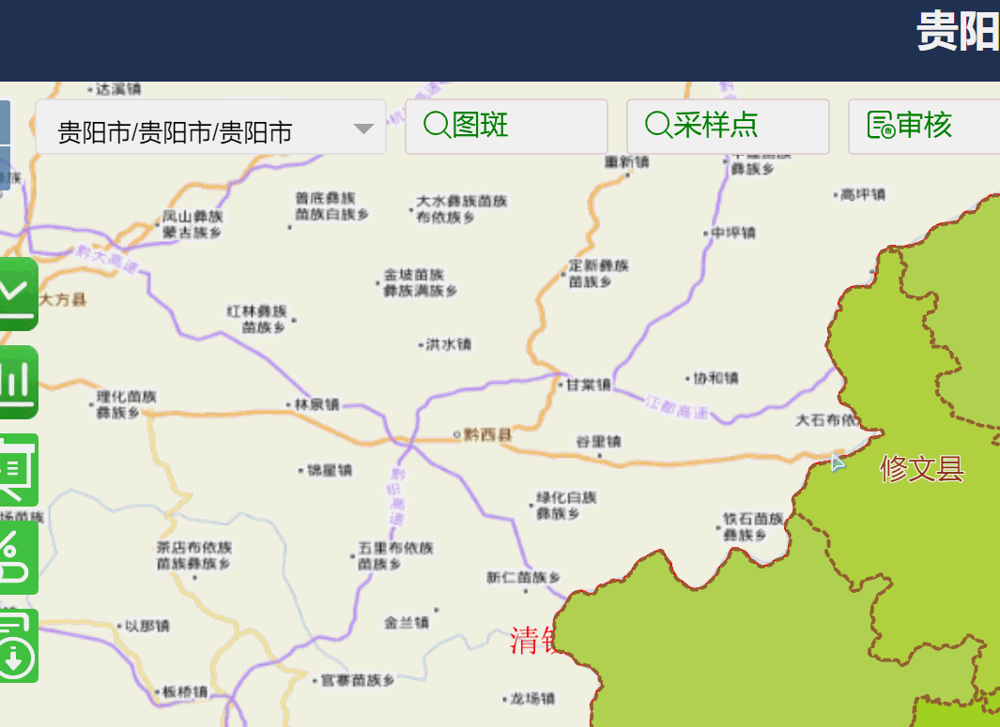

<!--more-->

关于使用VueAreaLinkage，自定义数据，动态设置绑定的数组后，行政区划组件上的label不发生变化的解决办法。

### 组件基本介绍及使用场景

> [vueAreaLinkage]https://www.npmjs.com/package/vue-area-linkage	"vueAreaLinkage"

#### VueAreaLinkage安装使用

5.0版本之后，可以通过`npm install vue-area-linkage --save`和`npm install area-data --save`安装依赖，在main.js种引入

```js
import VueAreaLinkage from 'vue-area-linkage';
import 'vue-area-linkage/dist/index.css'
 Vue.use(VueAreaLinkage)
    在页面组件内
import { pca, pcaa } from 'area-data'; // 城市数据
    
   // 在data中定义数据：
selected: [],
pca: pca,
 pcaa: pcaa
```

下面主要介绍之前版本直接将源代码引入项目中并根据需要修改代码，符合自己的应用场景。

#### 使用场景

实现市，县，乡三级联动，并通过点击地图区域，动态设置行政区划选择默认值。未修改的代码使用是，第一次设置默认值是生效的，之后通过修改绑定的selected数组，无法改变行政区划选择器上的label显示，下面主要介绍如何通过修改组件源码，实现设置默认值，行政区划自动更新。

自定义的region数据结构如下：



### VueAreaLinkage修改绑定Label不更新解决方案

以area-cascader组件为例

1. **根据自己的region数据，修改area-cascader中index.vue中的getActiveLabels函数，将获取provinces的Key设置为自己的，以贵阳市为例，修改源代码中的86为52.area-select组件做类似处理**

   

2. **修改area-cascader>index.vue,修改SetDefaultValue函数，源代码中setDefaultValue只动态设置provinceCode和province，但因为业务需求只有一个市，所以动态设置selected数组时，label不及时更新，因为不会激活设置SetDefaultCode函数，因此，这里首先需要修改动态添加默认值所选中的县和乡。修改代码如下：**

   ```js
   setDefaultValue() {
         let provinceCode = "";
         let cityCode = "";
         let areaCode = "";
         if (this.isCode) {
           provinceCode = this.defaults[0];
           cityCode = this.defaults[1];
           areaCode = this.defaults[2];
           this.curCityCode = cityCode;
           this.curAreaCode = areaCode;
         } else {
           const province = find(
             this.provinces,
             item => item === this.defaults[0]
           );
           assert(province, `城市 ${this.defaults[0]} 不存在`);
           provinceCode = find(
             Object.keys(this.provinces),
             item => this.provinces[item] === this.defaults[0]
           );
         }
         this.curProvinceCode = provinceCode;
         //-------------------------修改start
         //手动激活县变化
         this.citys = this.data[this.curProvinceCode];
         if (!this.citys) {
           this.citys = {
             [this.curProvinceCode]: this.curProvince
           };
           this.curCity = this.curProvince;
           this.curCityCode = this.curCityCode;
           return;
         }
   
         let curCity = Object.values(this.citys)[0];
         let curCityCode = Object.keys(this.citys)[0];
   
         if (this.defaults[1]) {
           if (this.isCode) {
             curCityCode = find(
               Object.keys(this.citys),
               item => item === this.defaults[1]
             );
             assert(
               curCityCode,
               `城市 ${this.defaults[1]} 不存在于省份 ${this.defaults[0]} 中`
             );
             curCity = this.citys[curCityCode];
           } else {
             curCity = find(this.citys, item => item === this.defaults[1]);
             assert(
               curCity,
               `城市 ${this.defaults[1]} 不存在于省份 ${this.defaults[0]} 中`
             );
             curCityCode = find(
               Object.keys(this.citys),
               item => this.citys[item] === this.defaults[1]
             );
           }
         }
         this.curCity = curCity;
         this.curCityCode = curCityCode;
         //手动添加镇
         this.areas = this.data[this.curCityCode];
         if (!this.areas) {
           this.areas = {
             [this.curCityCode]: this.curCity
           };
           this.curArea = this.curCity;
           this.curAreaCode = this.curCityCode;
           return;
         }
         let curArea = Object.values(this.areas)[0];
         let curAreaCode = Object.keys(this.areas)[0];
         if (this.defaults[2]) {
           if (this.isCode) {
             curAreaCode = find(
               Object.keys(this.areas),
               item => item == this.defaults[2]
             );
             assert(
               curAreaCode,
               `乡镇 ${this.defaults[2]} 不存在于县区 ${this.defaults[1]} 中`
             );
             curArea = this.areas[curAreaCode];
           } else {
             curArea = find(this.areas, item => item == this.defaults[2]);
             assert(
               curArea,
               `乡镇 ${this.defaults[2]} 不存在于县区 ${this.defaults[1]} 中`
             );
             curAreaCode = find(
               Object.keys(this.areas),
               item => this.areas[item] === this.defaults[2]
             );
           }
         }
         this.curArea = curArea;
         this.curAreaCode = curAreaCode;
   		//-------------------------修改end
         //this.$refs.cascader.setValue(this.defaultsAreaCodes)
         // 还原默认值，避免用户选择出错
         this.$nextTick(() => {
           this.defaults = [];
           // this.isCode = false;
         });
       },
   ```

   

3. **源代码为了避免循环调用SetDefaultCode函数，有一个`isSetDefault`的变量，标识是否已经更新设置行政区划，这里也需要改一下，因为源代码中`curAreaCode`的watch监听中没有将其设置为false，因此，即使手动设置了`curAreaCode`值，但因为没有改变绑定的defaultAreaCodes因此组件内部没有更新。**

   ```js
    curAreaCode(val) {
         this.curArea = this.areas[val];
         this.curAreaCode = val;
         //0328 add by weiyuan to resolve setDefault not to change
         this.isSetDefault=false
         this.setDefaultsCodes();
       }
   ```

   至此，完美解决修改绑定的数组值，VueAreaLinkage组件Label不更新问题。

   ### 项目使用实例代码

   **首先main.js中注册组件并初始化region，**

   ```vue
   import region from './assets/area-data/region'
   import VueAreaLinkage from './components/area-utils/index'
   Vue.use(VueAreaLinkage)
   Vue.prototype.$region = region
   ```

   **使用area-cascader封装cityPicker组件,这里还增加了根据权限过滤region数据，实现行政区划选择性显示**

   ```vue
   <template>
     <div>
       <area-cascader :level="level" v-model="valueArray" :data="permissionData" v-if="Object.keys(permissionData).length" />
       <!--<div>{{selected}}</div>-->
     </div>
   </template>
   
   <script>
   import AreaCascader from "./area-cascader/cascader";
   export default {
     name: "CityPicker",
     props: {
       level: {
         type: Number,
         required: false,
         default: 0
       },
       selected: {
         type: Array,
         default: ["5201", "520100"]
       }
     },
     component: { "area-cascader": AreaCascader },
     data() {
       return {
         valueArray: [],
         permissionData: {}
       };
     },
     created() {
       this.valueArray = [].concat(this.selected);
     },
     mounted() {
       //需要根据权限筛选region数据
       let user = JSON.parse(window.sessionStorage.getItem("access-user"));
       if(!user){
          this.permissionData = this.$region;
          return
       }
       this.userName = user.username;
       this.role = user.role;
       this.regionid = user.pac;
       if (this.regionid != undefined && this.regionid != "5201") {
         let allRegion = Object.assign({}, this.$region);
         if (this.regionid.length == 6) {
           //县级
           let city = allRegion["5201"];
           for (var key in city) {
             if (key != this.regionid) {
               delete city[key];
             }
           }
           for (var key in allRegion) {
             if (key.length < 6) {
               continue;
             }
             if (key != this.regionid) {
               delete allRegion[key];
             }
           }
           this.permissionData = allRegion;
         } else {
           //镇级
           this.permissionData = [];
           let countyId = this.regionid.substring(0, 6);
           let city = allRegion["5201"];
           let county = allRegion[countyId];
           for (var key in city) {
             if (key != countyId) {
               delete city[key];
             }
           }
           for (var key in allRegion) {
             if (key.length < 6) {
               continue;
             }
             if (key != countyId) {
               delete allRegion[key];
             }
           }
           for (var key in county) {
             if (key != this.regionid) {
               delete county[key];
             }
           }
           this.permissionData = allRegion;
         }
       } else {
         this.permissionData = this.$region;
       }
     },
     watch: {
       valueArray(curVal, oldVal) {
         if(curVal!=oldVal){
   this.$emit("selected", curVal);
         }
         
       },
       selected(curVal, oldVal) {
         this.valueArray = [].concat(this.selected);
       }
     }
   };
   </script>
   
   <style scoped>
   </style>
   
   ```

   **使用**

   ```vue
   <CityPicker
                   style="width:100%"
                   @selected="selectSearchRegion"
                   :selected="searchRegionArray"
                   :level="1"
                 />
   //需要动态修改是直接给searchRegionArray赋值即可，注意数组长度需要和联动级数匹配，即三级联动，数组需要长度为三
   ```

   ### 效果

   

   

